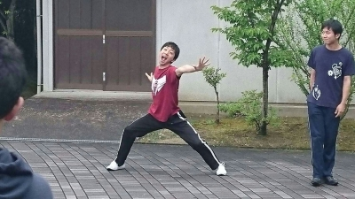
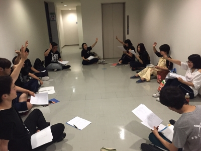

↑ジミーでしょうか？いいえ何でも

　

おはようございます！

三回生のジミーです！！

昨日書くつもりだったんですが、寝てしまいました(；´∀｀)

いやぁ、睡魔って強いですねー

　

ところで、劇団じょじょえんは役者選考二日目。

今日は一回生が前座打ち上げとのことで、上回生のみで選考を行いました。

深くは言えませんが、おフザケのシーンでは何であんなにも皆テンションが上がるんでしょうか。特に有吉さん。

　

台本の内容については「お楽しみに！」って感じですけど、中々面白いものに仕上がる予感がします！

まだまだ夏は始まったばかり。

これから全力で本番まで駆け抜けます！！

　

ということでお相手はズートピアをそろそろ観に行きたいジミーでした。

ペルソナに運命を左右された兄弟達の運命の歯車が今回り始める……

P.S.雨の日はQueenの『Lazy On A Sunday Afternoon』かシートベルツの『 THE REAL FOLK BLUES』を聴きたくなります。

## なついあつ

こんばんは！

本日のブログは2回生のジャンヌがお届けします！

今日は役者選考3日目でした。

梅雨のジメジメにも負けず、じょじょえんのみんなは元気モリモリでした！

久しぶりに役者選考を受けて、台本読んでいると、やっぱり楽しいなーって実感します。

今回の台本は……個人的には新しく知る言葉がいくつかあって、一つ賢くなったようでうれしいです！笑

最近の私はというと、先輩一年目ということでソワソワする日々です。

1回生のみんながほんとにかわいいんです！

話してるととても幸せな気持ちになります(\*´ω｀\*)

選考で読みを聞いてる今でもすごく上手なのに、役をもらってからどんなに変わっていくのかがとても楽しみです！

一緒に頑張っていきたいです！！

ラーメンが食べたすぎて己がラーメンになってしまいそうでしたが家に帰るとラーメンがあり食べれて幸せを噛み締めているジャンヌでした。
