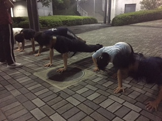

どうも、今日は雨でしたね。天気予報では言ってたそうでしたが。

今日のblogは4回生の出雲がお送りしますよー

さて、キャスト発表も終わったことで今日から段取りがつき始めました！

アブノーマルはけとか休みの人の代役の暴走とか色んな事故や名言()がありつつ着々とシーンの動きがついていきました！

せっかくの夏公なので夏らしく、元気に頑張っていきたいです！

写真は撮り忘れましたー！

明日の担当の人がいい感じのを撮ってくれると思うので許してくださいm(\_\_)m

## わたしは跳ぶのが苦手

こんばんは！！

3回生の如月です！

ことしの夏も、役者をさせてもらってます。どきどきの夏です。

さて。

きょうの稽古は～、きのうに続き段取りをつけてからの。

基礎練！でした！

みんなの基礎力をあげるべく、

ジャンプしながらカッティングやら体幹やらあめんぼダッシュやらをやりました。

個人的にはひさびさのあめんぼダッシュたのしかったです。もっと上手くなりたいですね。

期待の1回生も、夏が終わるころにはみんなたくましくなっていることでしょう。

わくわく。

それでは！
