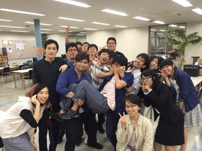

こんにちは、4回生のスナフキンがブログを担当いたします。

雨が止んだと思えば、今度は猛暑。

なかなか厄介な夏になりそうです。

さて、いよいよ本格始動した夏公演。

演出は、僕の同期であるじょうたろう。

彼と話したことですが、自分たちがあと半年でこの万絵巻を卒業することが信じられないです。

月日が経つのはあっという間です。

過ぎた月日を惜しむより、今を大切にしていきたいです。後輩に良い影響を与えることができるよう、今まで以上に練習に励みたいと思います。

写真は、19期生の茶髪さんと劇団じょじょえんメンバーとの一枚。

OBOGさん、いつでも稽古場にいらしてください。

iPhoneから送信
