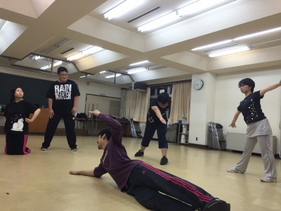

どうもこんばんわ！！

今回はついに三回生になってしまったマキがお送りいたします！

しっかし、最近は雨が激しい勢いで降り続いたり止んでる日がある！って思ったら予想以上に暑いですし、じめじめしていてなんといいますか...汗の止まらない日々になって中途半端デブの僕にはきついものがありますね(-""-;)

と、まぁそんなことよりも今回はじょじょえん初の公民館稽古でした！

卒公で使ってたときより広く感じました＼(^-^)／

最近の稽古は基礎を固めると言うことと筋トレや体幹などを意識しており、基礎練のときにすでにグロッキーな人も(笑)

始まったばかりの夏公...みんなでどんな劇を作っていくことになるのか？

一回生はどうなっていくのか？

まだまだ楽しみがたくさんあって興奮しちゃいますね

そろそろ眠気がピークなのでおいとまさせていただきます(／^^)／

みなさーん！これからは水と替えの着替えとタオルと制汗剤が必須の時期ですよー

今さらな言葉と共に締めさせてもらいました！

ではまた！！

...写真はポートレートのものです

いったいなんのお題なんでしょうねぇ？( ・ε・)
