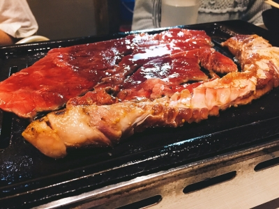

どーもどーもはっじめましてー！！！

１回生の小田充寿こと小田バーグでーす！！！

初めてブログを担当させてもらえるのでテンションがあがっております！！

じょーさん僕をいちばん最初に指名してくれてありがとうございます！！

さてさて、稽古はこれはもうスパルタでですね。横にいる栗田が夏終わったころにはガリガリになってるんじやないかと思うくらいハードです笑

え？もっちろん～僕はまだまだがんばりますよ！！

どんとこい！！！

唐突に最近の僕の悩みはですねあめんぼダッシュが嫌すぎることです。ほんとちゃんとできるようになるまでお披露目したくないです笑

でもご安心ください。そんな弱音は吐かずがんばることを誓いますから笑

今日の基礎練の喜怒哀楽エチュードは実は土曜日のチーム練で喜怒哀楽表現のメニューをこなしてるのでちょっと自信がありました。おかげでおおはしゃぎして久しぶりにエチュード終わってはぁはぁ言ってました笑　

まぁ、というわけで夏はまだはじまったばかり！！

この調子でがんばっていきたいなと思います！！！

画像はさっき僕が食べた晩御飯を表していますが、画像は打ち入りの時のです笑

それでは今日はこのへんで。

お相手は小田バーグこと小田充寿でした！！！

キレイキレイ⤴
