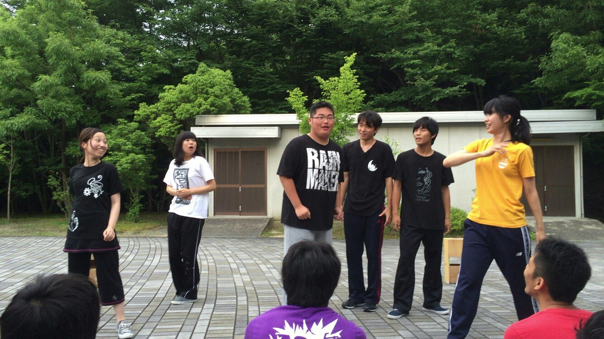
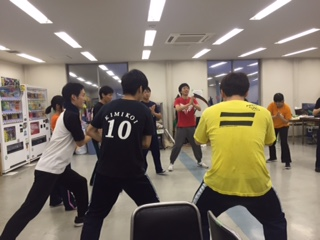

↑エチュード「料理」マヨネーズ好きな設定の栗田が場を掻き乱します。

カワバンガ！

そろそろ梅雨も開けて本格的に熱い夏がやってまいりましました。三回生のジミーです。

　

テスト前やら実習中の最終課題、レポート、ゼミという重圧に加えてサマーインターンというデカブツがのしかかってきてパンクしそうな三回生の夏ですが、皆様は如何お過ごしでしょうか？

じょじょえんは最近テンション上げに重きを置いてます。テンションなきゃ楽しい劇なんて作れないですもんね！テンションがあればなんでもできる。

そんな感じでチームの基礎連としては「3Things」と「重ね上げ」をしたりしました。

「3Things」といえば…あれです。お題をもらってリズムに合わせて関連ワードを3つ言う頭の回転を鍛える稽古です。

　

(お題:三回生)ジミー・如月・マキ！……みたいな

途中から何故かお題が個人的なものに変わっていきましたけど。

そんなこんなで、じょじょえんはチームのテンションを上げています。明日荒通し！！

そんなこんなでじょじょえんはこの夏、全力でハイテンションに頑張ります。

お相手は最近星占いの結果が芳しくなくて落ち込んだジミーでした。

p.s.ゴッドタンの「俺の落とし方発表会」新しい企画なんですけど好きです

## 荒通し

どうも、お久しぶりです。3回生のみつあみです！

最近は日差しがきつい日か雨が降ってジメジメしてる日かの2択が多いですね。過ごしにくい日々です。せめて早く梅雨明けしてほしいです…

さて、今日は荒通しでした！台本を持ってやってる姿を見るとすごいなと思います。特に1回生！初々しさがあって一生懸命頑張ってる姿を見ると若いなと感じてしまいます。これからも頑張ってね！応援してます！

以上、みつあみでしたー！
