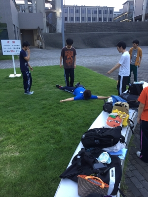

どうもこんばんわ！

稽古終わりみんなで楽しくバスのなかで喋っているマキが今回はお送りしたいと思います！！

今日は天気的にも非常に過ごしやすい感じで稽古にも力が入りました！

チーム合同の基礎練！

人数が多すぎて！ 多すぎて！！

壮観でしたね(／^^)／

チームに別れてからは基礎はケツカミをしっかりする練習、稽古は自主練でした！

荒通しを通して不足してたところを役の人と話し合ってプランを見直す...有意義な時間でした((o(^∇^)o))

まだまだ夏はこれからです！！

納得のいく楽しい夏になっていくことでしょう！！

その前にテストという壁が近づいてきているのでしっかり単位を取って楽しい夏...ですが(笑)

では今回はこの辺で！

熱中症には気を付けてくださいねー！！

マキでしたー！

写真は僕を使って反復横跳びをしている出雲さんです
