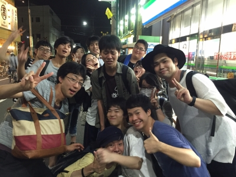

1回生の頃思ったことなんですけどね。「可もなく不可もなく」って言葉あるじゃないですか。大学生の理想ですよね。4回生の出雲です。

今日はサイレントエチュードとか7ボーズとか、それとテスト前最後のシーン回しとか、色々しました！

今日はタコ８でミスったのが凄く悔しいです。７ボーズなら絶対負けないのに！

明日からテスト休みに入るのでしばらく稽古はお休みです。7月末にまた会いましょう！お楽しみに！

P.S 今日はOBさんがたくさん来てくれました！
