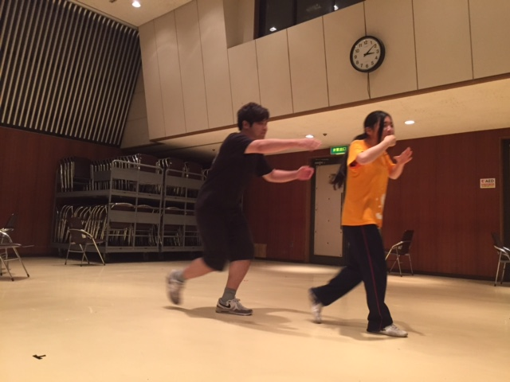
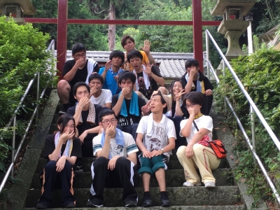

1日遅れで失礼します。

2回生のこにたんです。今回はシーン回しを中心に稽古をやっておりました。その他にはあめんぼダッシュ。あめんぼダッシュで自分の基礎能力の低さを痛感しておりました。

そしてついに、OPの練習も始まりました。とてもハイクオリティになる予定なのでご期待ください！

さて、シーン回しを見ていると、少しずつ1回生の成長が見られて良かったです。台本締め切りも近づきつつある今日この頃、台本を取った瞬間に焦りが出ることだけは避けなくては。

写真はたけのこニョッキの罰ゲームとなった2人のボケツッコミエチュードです。テーマは『ミューズ食堂』。如月さんが見本のカレーを食べとります。

では、これからも熱中症に気をつけつつ、頑張っていこうと思います！

## ニョッキッキ！

こんにちは！

2回生のジャンヌです。

今日は夏休みに入って初めての学校稽古でした！

午前はイリエッティチームと一緒に萩谷まで走りま

した！去年よりも楽に感じたので体力ついたのかな、

嬉しくなりました。

帰りは1回生と全力で歌いながら歩いたり走ったり

しました。楽しい子たちです。

夏を感じました！

そして午後はたけのこにょっきでテンション上げて

からのシーン回しです。

シーンを回す度に課題がみえてきて頑張ろうって思

います。にょきにょき成長している1回生たちにも

ぜひご期待を！

p.s.最近演出さんはメガネを買いかえたそうです。私も買いかえたいです。
