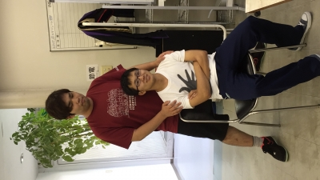

おはこんにちこんばんは、2回生のDJかおりです。

最近とても暑いので冷たくて甘いものが食べたくなります。

さて、今日も学校で元気に稽古をしました！

立ち位置を細かく調整したり感情や動きを意識したり、だんだんと作品が出来上がってきていて見ていて楽しいですね！

台本締切前日ということもあり、台本を見ずに台詞を言っている役者さんも多かったです。

1回生が一生懸命がんばっている姿を見ると、自分もがんばらなきゃと思います。がんばるぞ！

写真は無心に台詞を口に出す二人です。目が怖いです…

p.s.今日は19期生の茶髪さんが来てくださいました！すごく面白かったです！差し入れありがとうございました！！
