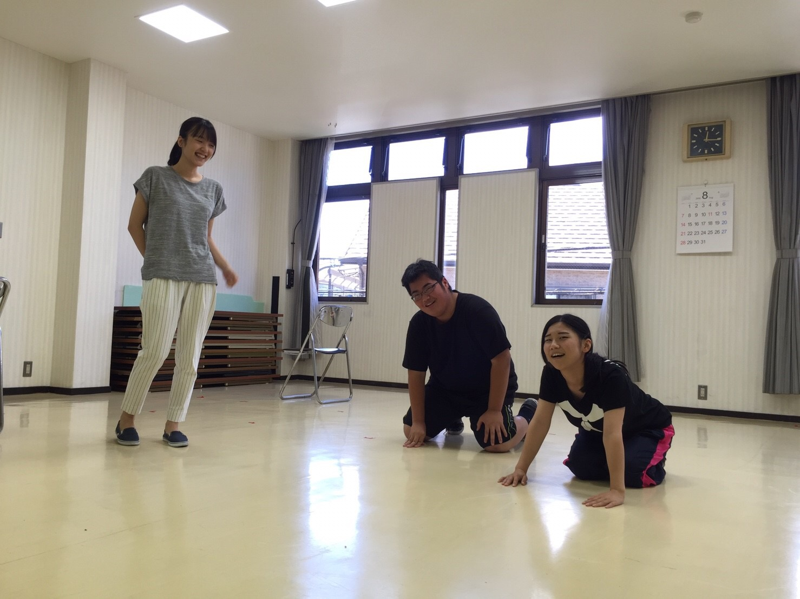

おはようございます！4回生の出雲です。

昨日は仕込み説明会でした。8月も後半ですね。最後の夏が終わると思うとゾッとします。

始まってから2ヶ月とちょっと、キャンプや球技大会と色んなことがありました。

1つ1つ全部が楽しく、思い出深いものとなりました。

そんな稽古期間も残りわずか、ここからは今まで以上に楽しく、全力で打ち込もうと思います！

皆さん、疲れてはいますが寝オチには気を付けましょう。

## ラストスパート

## ラストスパート

## ラストスパート

4回生の有吉です！

今日は久々の真上公民館稽古でした。

写真は正統派小道具期待のホープ、世界のエチュードの様子です。

ところで、4回生みんな言ってますが、最後の夏公が終わりに近づいています。早い！信じられない！アンビリーバボー！ですね。残り少ない時間を大切に過ごしたいと思います。

さて稽古もラストスパートとなり濃密な稽古の日々が続いています。そろそろ疲れも出てくる時期ではありますが、体調管理をしっかりして最後まで駆け抜けましょう！
