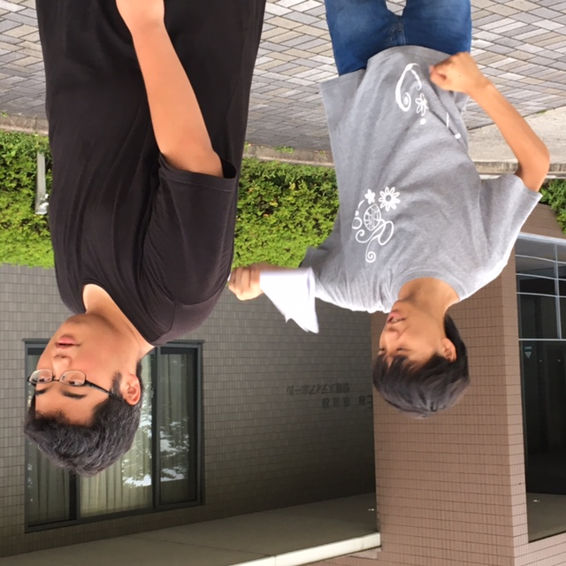

こんばんは。

4回生のすなふきんがブログを担当します。

今日を除くと、練習日数は残り3日になります。役者一同、1日の重みを噛みしめながら、練習しています。

僕も、何度か役者をさせてもらいましたが、未だに本番前は緊張します。

たまに舞台で失敗する夢を見るくらいです。正夢にならないことを祈ります。

経験がまだ多くない1回生なら、尚更緊張するんじゃないでしょうか。

しかし、緊張を乗り越えて、舞台の楽しさを知って、また次の舞台にも立ってもらいたいです。

彼らが舞台の楽しさを知る過程の中に、僕らが少しでも居れば幸いです。

※写真は、チームで一番体重の軽い演出じょうたろうと、一番重い1回生の栗田です。体重の差はタイトルからご想像ください。

iPhoneから送信
