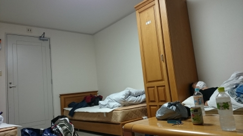

こんばんわ。本番前の夜小屋入りしてるジミーです。

部屋にはスナフキンさんと牧がいます。

そんなことはさておき、明日(書いている時点では26日なので)が本番です。なので色々思い返しながらブログを綴ることにします。

今年は夏公演自体早いこともありますが、それを差し引いても短い時間でした。楽しいときって一瞬なんでしょうね。そんな短い時間の中でうちのチームの一回生は必死に食らいついて、一回生に教えるべきでないことも物にしようとし、明日本番を迎えます。

高額館に泊まるのも恐らく今年、来年の二回。完成した舞台を見てると「あー、●●(役名)も明日で最後かー」「もう少しじょじょえんやりたかったなー」と思ってしまっている自分がいたりしました。未練たらたら野郎です。

そんなこんなで明日は本番。他チームのお芝居も楽しみにしつつ、場を盛り上げるため一番目、チーム一丸となって頑張ります！！乞うご期待！！

では皆様、明日の本番でお会いしましょう！！お相手はジミーでお送りしました。
