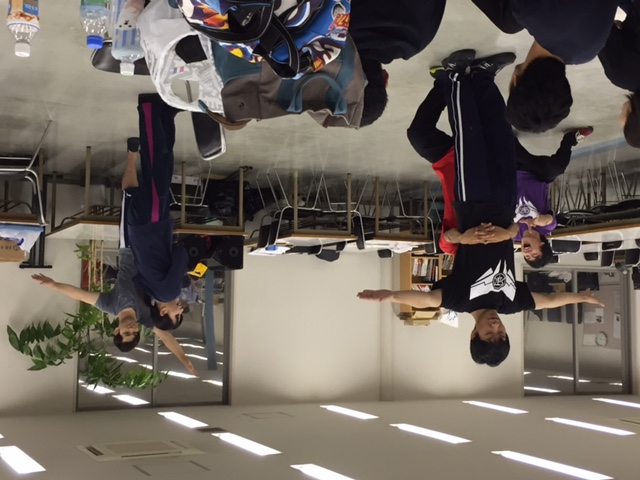
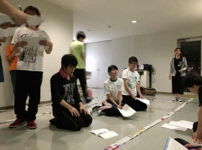

こんばんは～

かなり久々にblog書かせていただきますは、4回生音響のぷーです。

今日はチーム分け後はじめて稽古を見に行きました！

そして今日はキャストが決まりたてでの段取り付けでした。

思い返すと私は3年間この段取り付けの稽古を見たことがなかったです。

演出さんは演目の全体を考えて一つ一つ段取りを考えていると思うと心から敬慕します。

万絵巻としての最後の夏、悔いのないよう一意専心に頑張っていきたいと思います。

## 夏じゃぁ！

夏ですね！夏といえば山！川！海！！

そう！海の季節ですね！うみです！

最近、てっちゃん(インテグラル)にラインで「海さん」と呼ばれます。

なんだかんだで四年目にして初めて。

四年…かー

私も大学四年生。人生最後の夏休み。

今年の目標は「4年間で一番楽しい夏にする！」です。

難しいですよ。これは。

なんたって、昨年演出をしていた身。

演出をすれば、自分好みの台本を使ってなんとも自由に作れるのです。

やりたいことを全開で出来ました。

最強です。

主役とヒロインにエロ本を取り合わすことだって出来るのです。

ワガママな私は、今年の夏に昨年を越える楽しさを見出せるのでしょうか！？

…いや、見出します！

"今年の夏を、人生で一番楽しい夏休みにしてみせます！！"

と、自分の話をした所で。

今日の稽古は昨日に続き、段取り付けしました！

そして段取りを確認して終わり、ではなく。

演出からの熱いダメだしが！！！

そして応える役者たち！！！！

汗だく！！！

でもまだ！！！！！！！

課題が一杯！！！！！！！！！！！

明日も頑張ろう！！！！

以上、体を動かして気分爽快、ちょっと調子にのっているうみでした！
