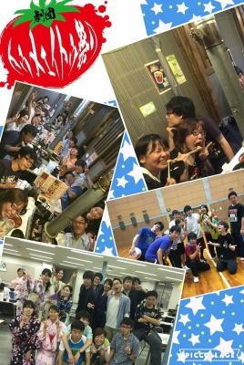

この3日間blogがなかったですね。その理由は3日ともイベントラッシュで稽古がなかったからです。なら何故blogを書いているか……、それはイベントを纏めるblogを書きたかったからです！

あ、と言うことでお久しぶりです2回生のパズーです！

早速3日間の振り返りいってみたいと思います。

まず、来る7月7日、そう七夕でした。女性は色とりどりの浴衣！男性は甚平！1人アロハ！(自分)皆わいわいお菓子を囲んで歓談！歓談！最後には皆思い思いの願いを短冊に込めていました。皆の願い叶いますように。

その次の日、トゥメェイトゥメンバー20人を引き連れうちいりを決行しました！僕らの前に広がる肉！肉！肉！そして山盛りご飯！そしてスイーツ！どのテーブルも楽しそうでした！

そして、更に次の日、焼肉でつけたもりもりパワーで狙うは優勝！球技大会が行われました！前半戦のバスケは我らがトゥメェイトゥが押していましたが、後半戦のドッジボールでイリエッティの追い上げにより結果は2位でしたが、とても楽しかったです。

ということもあり、この3日間全力ではしゃぎ倒して今日は全身が痛く満足感でいっぱいです。実は今日も稽古はなく、僕は久しぶりにバイトも入ってないので家でゆっくりしたいと思います。

この3日間がっしり団結力を固めどんどん成長していく劇団トゥメェイトゥ祭り本番をお楽しみに！！

to be continue…
