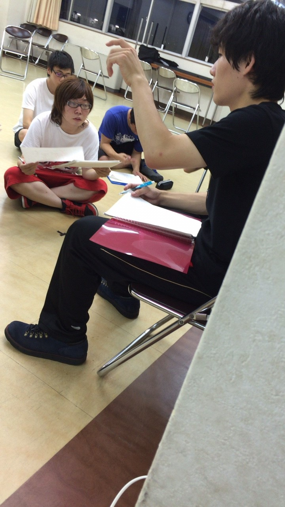

お久しぶり！ではないですがパズーです！

僕たち学生にとっては悪魔ともいえるテストが目前にまで迫っておりますね(泣)

ですが、そんな憂鬱な気分を吹っ飛ばす勢いで本日は公民館稽古を行いました！

本日は初めての通しということもあり、基礎練を入念に行いました。柔軟では何処からか呻き声が聞こえていましたんですが幽霊でもいたんですかね。その後いくつかシーン回し後本日のメインイベントであるあら通しを行いました。

去年、通し後のダメ出しで全員に聞きに行くだけで自分が誰かにダメ出しする事が出来なかったこの自分ですが、1回生が聞きに来てくれて自分も先輩としてもっと頑張らないとと思いました。

自分に対するダメ出しでも直すべき課題が山のように見つかったのでこれからもっともっと頑張ります！

あら通しは今日明日と2日に分けて行うので明日のために今日はゆっくり休みます。

それでは、おやすみなさい！

## 荒通し後半戦

1回生の西澤カルピスです。今日は2日間にわたる荒通しの最終日でした。残念ながら1日目の前半戦は教職で満足に参加できませんでした。しかし、1日だけでも課題はまだまだ山積みである事を思い知らされました。これからテスト期間に入り稽古はしばらくお休みになってしまいますがその分たくさん勉強して、取れる単位は取って万全の体制で稽古に祭りにキャンプに臨みたいと思います。

## あっづいぃぃーーー

最近暑い日が続いてますね。そんなあなたにビタミンC！すみレモンです&#127819;

今日の稽古では、たっぷりの基礎練と、荒通し後半編をしました！

まず基礎練で衝撃だったのは、7ボウズで３回アウトになった人...

の！

両隣りもろとも罰ゲーム、という新感覚7ボウズをしたことです。

うみさん、もも、パズーさんの一発芸が見れました。楽しいですね！

次に荒通し。みんなでひとつの舞台をつくるって、とてもステキですよね。演劇始めて良かった！&#9825;て思います。照

本番まで、もっと楽しみたいと思います。

それでは、また！
