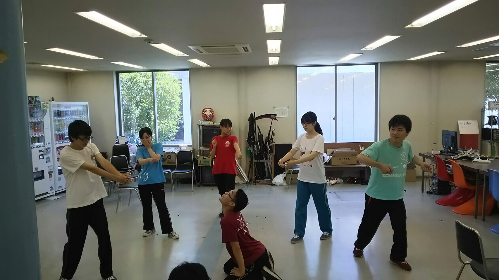
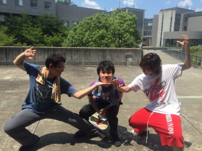

こんばんは、名前の割にはポケモンゲットしていないさとしです！

今日からみんな大好き夏休みが始まりましたねっ！！

今日は基礎練習メインで稽古していきました！

まず萩谷総合公園まで走りに行きました。

僕は二年ぶりに萩谷へ走りましたが、やっぱりハードですね…。１回生たちは途中迷子になる人も出ましたが、先頭の方で頑張って走りきってました！

次に7ボーズしました。生き残り戦では１回生もだんだん生き残る人が増えてきました！そして生き残ったのは2回生のあおいでした！ 次は生き残りたいですね…！

その次には、空間補充、エチュードをしました！

四回生になってもこれだけは苦手ですね…。でもダメ出しされてそこから演技の面で成長するきっかけが出てくるんで、後輩たちの見本になれるよう頑張ります!!

最後にシーン回ししました。やはり夏休み中だと稽古時間が多く、色々な基礎練習ができるんで楽しいです！楽しみつつ役者としていい演技ができるよう頑張っていきたいと思います！

写真は、空間補充からのポートレートでお題は「釣り」です。

## エチュードとは

こんばんわ！筋肉痛が遅れてやってくるようになったきゃめろんです！

最近めちゃめちゃ暑いですね！しかし、その暑さに負けじと我々は炎天下の中学校稽古でした。演出は容赦なくたるえだや体幹をさせてくるので、汗ダラダラです。飲み物を何本も買うはめになりました…

そして今日は演出によるエチュード講座が開かれました！わざわざプリントまでつくってくるという本格仕様で「なるほどな」と学ぶことがたくさんありました。これからどんどん意識してやっていきたいですね！これからも稽古がんばります！
