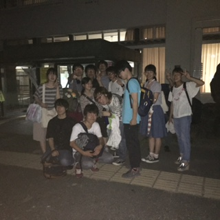

お疲れ様です。8月ですね！

私の季節です。そう、うみです。

役者兼衣装チーフです。

もうすぐパンフ撮影です。

私事ですが、先月ミシンを買いました。

作業の速度が、手縫いの頃の20倍早くなりました。

すごい速さで自分の考えた物が形になっていく。快感です。

因みに先日、撮影日に来れない人の撮影をしました。

いつも思うのですが、自分の妄想が具現化するのは、やっぱり鳥肌。

衣装たのしい。

まだ一人しか具現化できてへんけどな！まだまだ！

思い返せば三年前の今は、衣装に全く欠片も興味がなく、小道具チーフをやっていました。

しかし夏公のドレリハや本番で、4回生の先輩の作った衣装を見て「すっげーーーーー！！！こんなの作れるようになりたい！！！」と思ったのが衣装を始めるキッカケでした。

今は、私もその時の4回生の先輩のようになれてるか？と思いながら作っています。

多分セーフ？…いや、正直に言うと分からないです。

…自分が作った物が誰かの記憶に残るとしたら、そんな嬉しいことはない。頑張ろう！

そんな感じで気合い入れいます衣装、是非見に来て下さい！！！！！！！！！

8/27(土)です！！お仕事のない方は是非！！！！！！！！！！！！

お仕事ある方も有給を消化して是非！！←世間を知らない系学生だから言える台詞ですねー

OB・OGの皆さんとお会い出来るの、本当に楽しみにしています(\*´ー｀\*)！！！！！！！！！！

今日は19期生のちゃぱつさんが稽古場に遊びに来て下さいました！

笑いと差し入れとアドバイス、本当にありがとうございました！！

明日からも稽古に作業に、がんばるでー！

写真は稽古後にパシャり。

ホロ以外はおばけのようですね。
