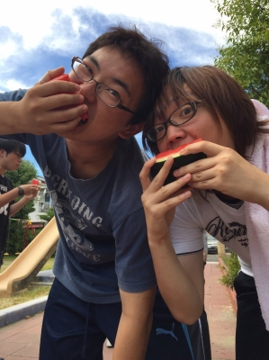
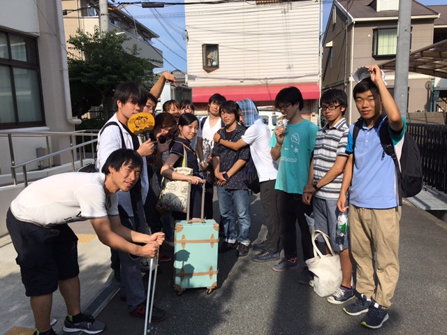

こんにちは、2度目のブログを担当させていただくことになりました。銀です。最近暑い日が続くので冷たい&涼しいものを求めたくなるものです。σ(^\_^;)

そんな中今日は楽しいキャンプが終わってからの最初の稽古となりました。

シーン回しや空き時間の練習の様子を見ていると最初の時と比べて間違いなく良くなっていると思います。なので僕もこの勢いに乗り残り日数は少ないですが頑張っていきたいです！！

さらに今日は休憩時間にキャンプで消費出来なかったスイカでスイカ割りをしみんなで美味しくいただきました！

写真は割ったスイカを貪り食べるパズーとももです 笑

「夏」という感じがあり実に良いものでした！

それでは、明日も格好良く決めたいよね！がんばルビィずら！⌒°( ・ω・)°⌒

P.S.体調管理にはくれぐれも気をつけて下さい！！

## 「実家に帰らさせていただきます。」

こんにちは！

私事ではありますが、まさに今広島へ帰省している最中の2回生あおいです。

普段は在来線で6時間ちょっとかけて帰省しておりますが、今回は稽古時間の都合で初めて高速バスを利用しております。

バス酔いしないうちにブログを書かせていただきます。

まず今日の稽古について。

今日は基礎練でボケツッコミエチュード(複数人バージョン)を行いました。

私は広島出身で、かつお笑いを殆ど見たことがないのでボケとツッコミの定義から分からないんですよね。

入学当初は友人に、ボケてるんだからつっこんでよとよく怒られておりました笑

上手くできなくてもどかしいので上手くなりたいです…！

だんだん本番が近づいてきて稽古も熱を増してまいりました。

去年は1回生で多くの先輩に指導していただきながら壁に激突してた訳ですが、今回は逆に教える側にも立っており、教える難しさを実感しております。

加えて自分自身も様々な壁にぶつかっております。

私はかれこれ中高含めて6年間演劇に関わっている訳ですが、それでも初挑戦なことが多々あるので、後輩や先輩と相談しながらより良いものになるよう奮闘しております。

以上、高速道路に入って、キャンプで運転した記憶を思い起こしているあおいでした…！
