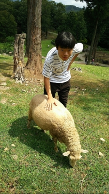

こんばんはっ。もうすぐ待ちに待った夏公演ですねっ！すみレモンですっ(^^)ノ

今日はいつもどおり、朝から集まり稽古をしました。もぉ～外は暑い！みんなうちわで扇ぎあったり、冷えピタ（？！）をはったり、塩分チャージしたりと熱中症対策を徹底していました。水分もこまめに取りましょうね！！

さて、前回に引き続き一回生の他己紹介です。

今回私すみレモンが紹介させて頂くのは...カルピス！です。

私のカルピスの第一印象は、落ち着いた青年のイメージでした。今は少し違って、なかなか味のある青年です。なんといってもボケツッコミエチュードがとにかく面白い！観る人をカルピスワールドへ引き込んでいきます...

ひとつショックだったのは、ある日カルピスがカルピスを飲んでいる（！）時、カメラを向けると撮影拒否されたこと...デスね。ぐすん。

今嬉しいのは、毎日一緒に稽古をしている中で、カルピスがだんだんと心を開いてくれているように感じることです。休憩中でもちょこちょこ会話してくれたり、的確なアドバイスをしてくれたり、、！！

毎日が稽古で大変だけど、こうしてメンバーの魅力を知っていけるのも、稽古の醍醐味ではないでしょうか(^\_^)

ではでは、あと少し、本番まで力振り絞ってがんばるぞ！
