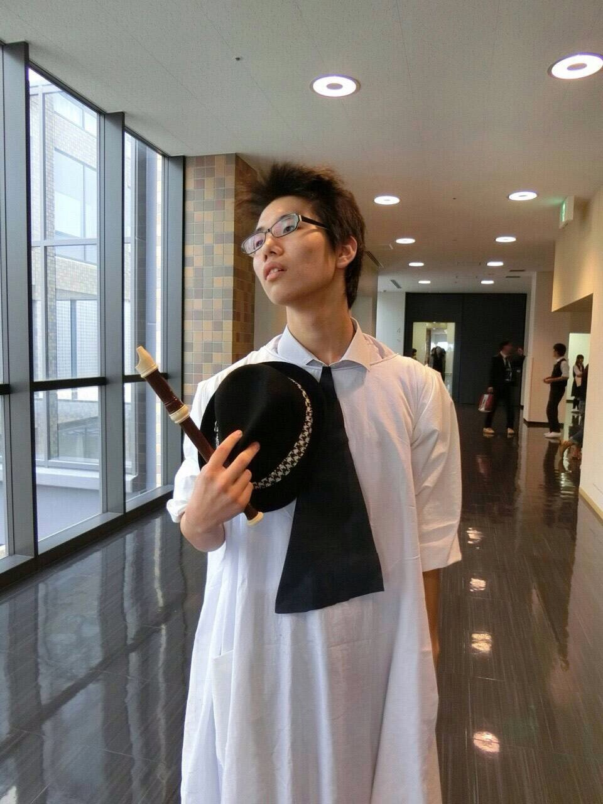

どうも量産型カルピスこと、西澤 健治です。僕の紹介を書いてくれたすみれ！ありがとう！1回生がお互いに紹介を回していくということで今回僕が紹介するのはジョンポールです！

彼は僕と同じ万絵巻23期生で、本名をは上穂 海生で、万ではジョンポール呼ばれでいます。主な役職は音響です。塾講のバイトをしています。頑張り屋で誰とでもすぐに仲良くなれる性格の良さがあります。人を褒めたり、笑わせたりするのが凄く上手です。ただ最近は色々と頑張りすぎて少し不安になる所もあります(^^;

上の写真は高3の文化祭で演劇をやった時の役者の衣装です。ヒ○シのモノマネじゃないですよ。

## 溶ける！

お久しぶりです！

1回生のジョンポールです。

これでブログを書くのは２回目になります！

なんて暑さだ！！溶けるような暑さです。

立ってるだけでフラフラするし、飲み物飲

んでも飲んでも喉渇くし！

今年の夏は、ひたすら暑いなあと思ってお

ります…(´・ω・\`)

でもでも！暑さに負けず突っ走ってやりま

しょう！（笑）

さて！回ってまいりました他己紹介ですが、

本日紹介致しますのは…

かなめデス( ˊᵕˋ )

かなめは、一言で言うと、落ち着いた性

格の、良き青年であります！

真面目に全力で稽古やシーン回しに参加し

ていて、素晴らしいなと僕は一目を置いて

います。

また、喋っている時の笑顔がとても素敵で、いつも元気をもらっています( ˊᵕˋ )

たまにはボケてみたり…お茶目な1面も年に

数回程度見られるかも知れません☆（笑）

かなめの演技にも、引き付けられるものが

あります。エチュードなどでは、普段の冷

静なキャラクターだけでなく、全く違うぶ

っ飛んだキャラクターの演技を見せてくれ

るのです！

さらに！最近では、僕たちと一緒に万絵巻

に入りたての時とは比べものにならない

ほど、バカデカイ声が出るようになりま

した！素晴らしい成長っぷりです(OдO\`)

これからのかなめの成長にも期待大ですね☆

これで、かなめの紹介を終わります☆

本番まであと少し！全力で駆け抜けまし
