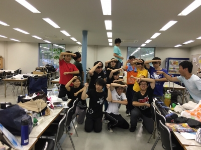
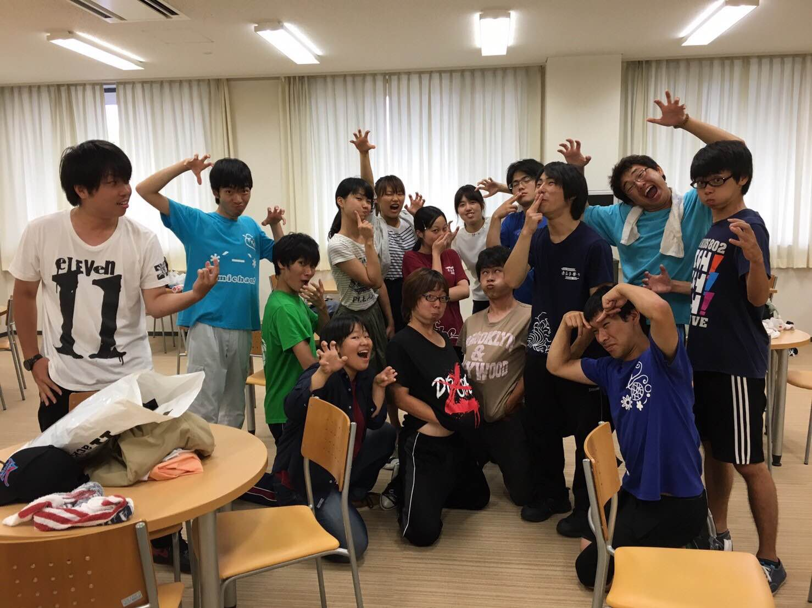
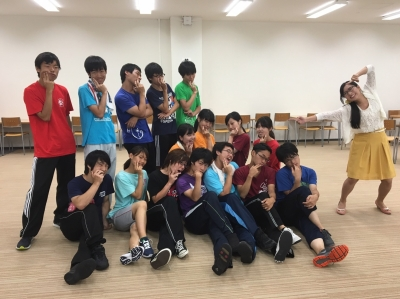

こんにちは！さとしです！

あと何日かしたら本番です。早いですね…。

昨日は建て込み稽古をしました。途中から雨が降ってしまいましたが、本番前にしっかりと建て込むことができてよかったです！

建て込んでやる稽古は、段の上り下りの感覚を掴みながらできるんで、演技の質が上がりますしね。

あとうみちゃんも言ってましたが、万の夏はやっぱり楽しいです！ほぼ毎日稽古するなか、お祭り行って踊ったり、キャンプで山川海に行ったり花火したりでかなり濃い夏やなと思います！

もちろん今年の夏もうどん作ったり、ホースの水浴びしたりして濃い夏を過ごしました！！こんな楽しい夏を過ごせるのは、万だけです！

そんな夏ももうすぐ終わってしまうわけですが、最後にふさわしい演技と舞台作りをしようと思います！

写真は、トマトのみんなが僕の真似をしていて、僕がツッコミをいれているところです。

腕を上下に構えているポーズは、二年前の夏公のポーズの一部です。最初から最後まで出来ている人は今のところ見たことないですね。

ホロのポーズは、稽古中１日20回ぐらい誰か(大体ホロ)がやっており、バリエーションも豊富になってきました。

じじは…目を真似していますね。

以上四回生さとしからでした。最後の夏公最後まで頑張っていきます！！！

## 盛夏の成果を…

週明けには夏公が終わっているという寂しさ…

こんばんは、今日のブログを担当させていただきますは4回生のぷーです。

早いもので夏公の稽古も残すところあと1日となりました。

日々成長していく役者さん達(特に1回生)を見るのが楽しくて楽しくて、もっとこの時間が続いて欲しいと思うと同時に、他チームに早くウチの子達を見て欲しいという思いもあって自分の中の感情がめちゃくちゃです。

また、最近1回生に雑な絡みをして雑な対応をされるのが嬉しくて仕方ないです。こんなことを思うと自分も上回生になったなと実感します。

残り少ない最後の夏公、チーム全員で楽しんでいきたいと思います！

写真は僕の真似をするみんなと、キレてる僕ですw

真っ先に腹と頬を膨らませた奴らは許さん！

がおーってくまの真似してる子らは可愛げがありますね～

それでは、こんなに真面目にブログを書いたのは初めてなぷーでした！

## GOIN`!!!

こんにちは、茉莉花です。

今更なんですけど、これでじゃすみんて読むんです。まりかじゃないですよ(´・ω・\`)&#128166;

本番まで近づくに連れて最後の夏公なんだ…と過去を振り返って少しノスタルジーになりますね。

私は広報専任なので広報の想い出がいっぱいあります。

レイヤーすらわからなかった私が今は、最上回生として後輩ちゃんに教えたりしてるんですよぉ？びっくりしちゃうよね(笑)

まだまだ勉強したいことは沢山あるけど、精一杯楽しんで頑張っちゃうんだから！(><)&#10024;

写真はシリーズ化されている『私の真似をしている皆とツッコミを入れる私』です。これは去年の海での写真のポーズですね(笑)事前に写真を参考（ver.私とver.らむ）に練習して来てくれていたようで、腹立つぐらい完璧に再現してくれていますね。皆には私がこう見えているのか…と思うとちょっぴり恥ずかしい(///－///)&#128166;

でもそれぞれの個性があって面白い。個人的にはカルピスの口がむにゅっとなってるのがあざとくて評価点高いですね。

最後まで頑張っていくぞ！

さぁ、同じ風に乗っていこう！

Hop! Step! Jamp! Don't stop dreaming!
