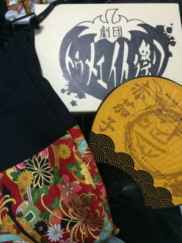

お疲れさまです、

夏演出だったじじです！

あっという間に夏公が終わってしまいました。本当にあっという間と感じるほど立ち止まる事なく全力投球で日々過ごしてきました。

殺陣もダンスもパワーマイムもランマイムもチームうちわも映像もエンタメも

自分が今まで先輩から学んだ事、やりたい事を全部全部詰め込んだ盛りだくさんのオリジナル。

正直、形になるかどうか中途半端にならないかどうか不安でした。

書き上げるだけで何百と苦労、劇にしていくのに何千と苦労、、

かつて無い思いをしたと言えるほど、大変でした。

そして、自分の力の無さを痛感する日々でした。

でも、チーム全員に支えられました。

どんなに雑なアイデアも真剣に向き合ってくれ、それを遥かに超えるものに仕上げてくれたチームのみんなに頭があがりません。

チームT、チームうちわを劇に取り入れるのも

2ヶ月の努力を映像に映すのも

「我心」を真っ二つに斬り、EX極限に「オシマイ」をつけるのも

やってみたい！と、ただ口で言うのは簡単ですが形にするのはかなり難しかったと思います。多くのしんどい思いをさせたと思います。

本当に何から何まで時間を費やしてもらい

自分は幸せ者だと思います。

作品が出来上がり、お客さんからおぉー！の拍手やたくさんの笑い声をいただけた時、味わったことのない達成感と涙を抑える事ができませんでした。

毎日毎日楽しかった！

稽古に球技大会にお祭りにキャンプに、気づけば本番でした。

本当にやりきった！

後悔もやり残した事もないです！

完 全 燃 焼

ラスト夏をこのチームで過ごせて本当によかったです！！

本当に最高の夏でした！！

本当に本当にありがとう！

バイバイ！
