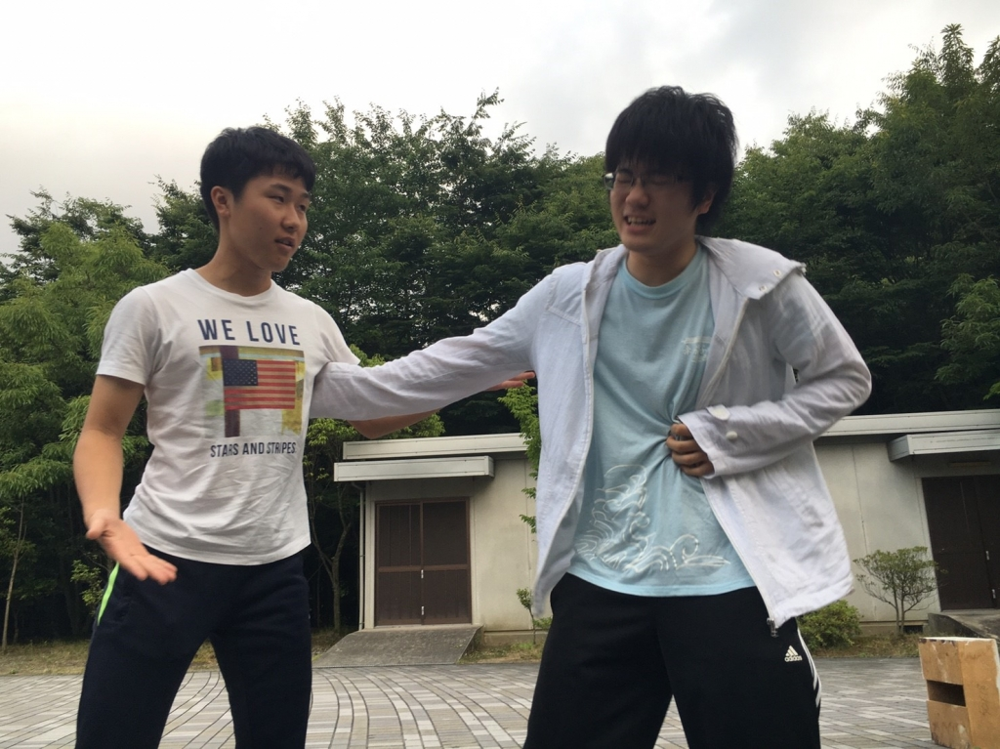

↑エチュードでカッコつけに興じるホロとデイビット

よくわからない天気が続く中、皆さん如何お過ごしでしょうか？4回生のジミーです(^o^)

熊背負いは稽古のペースが早く、もう既に連日のシーン回し！演出さんの熱いダメ出しが飛び交います。

演出さんの思いに必死に喰らいつこうと、一回生含むメンバー全員が取り組んでいる様は中々打たれるものがありますね。

のらりくらりと万を続けて四年目、いよいよ最後の夏になってしまいました。

今年のジミー的な夏のテーマは「成長」です！

自分もこれまでにない感じの演技をお見せして「あーやっぱりジミーっていいなー」って思われたい！！

なので一回生や後輩同期に負けないよう頑張りますく(｀・ω・´)

※その位今回皆凄いです

ではでは、最近グレープフルーツジュースの美味しさに目覚めたジミーでした！

see you space cowboy…

P.S.最近ラップの芯で殴られ気絶する夢を見ました。怖かったです。
