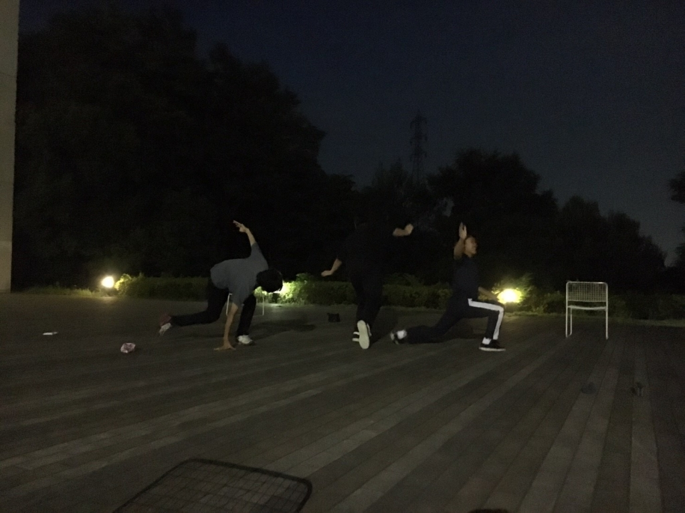

お久しぶりですの方も初めましての方も、よろしくお願いします。

3回生の椎名真咲です。

今万絵巻では、夏の自主研究発表公演に向けた稽古に励んでいます。

最近とても暑くなってきていますが、私たちの熱量も負けておりません！

毎回の稽古をテンション高く、挑んでます！

今日の写真はとある基礎練習のものです。

全身の動きを意識してのスローモーションとその後のジャンプとターンで

自分の持っている力を爆発させるものです。

各々持っているもの以上のものが引き出せるように、日々励んでいます。

これからの成長が楽しみです。

暑さに負けず、乗り越えてみせる！
