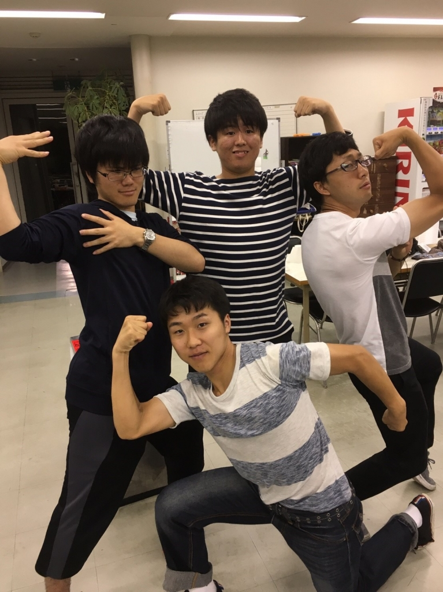

おはようございます。どうもよろしくお願いしますm(\_ \_)m 1回生のデイビッドと申します。最近、「脳筋」という言葉をよく耳にします。ここで言わせて下さい&#8252;&#65038; 僕は脳筋ではない、よな。。。

まぁそんなことはさておき、台風が通り過ぎましたが、梅雨の本格的な蒸し暑い日々との闘いが続いております。暑さに負けずに頑張りたいものですね！

本日は基礎練とシーン回し等をしていきました。シーン回しでは声の出し方、振り付け等難しいものやアレンジの必要なものがたくさんありますが頑張っていきたいと思っております。

『早く台本覚えたいな～』

そんなデイビッドでした。よいしょー
