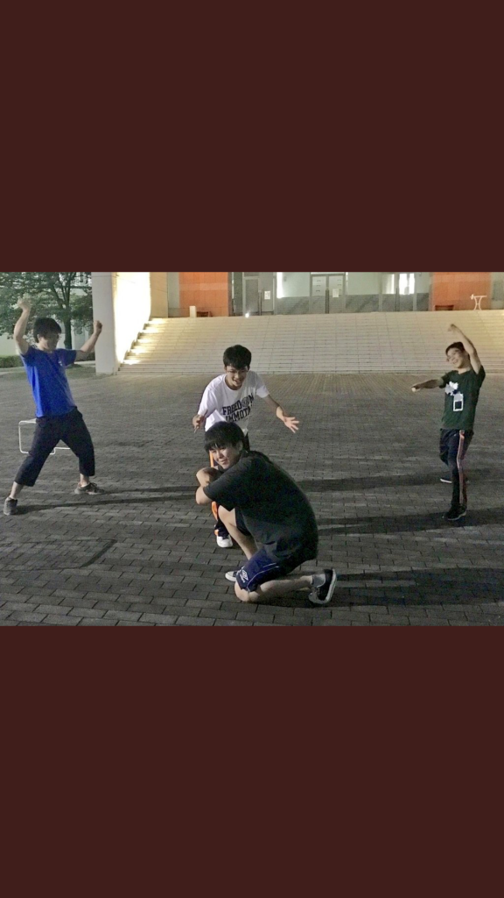

昨日の大雨はなんとやら

今日の稽古はお天気でしたー

わーい＼(^o^)／

やっぱ雨の日はテンションが下がりますねー

雨の日にハッスルしちゃう人は

前世が”カエル”か”ナメクジ”……

おそらくは”アメンボ”だったんでしょうねー

あ、自己紹介が遅れました、一回生のミカドです。

グレンからの… デービットからの……

ミカド……

フムフム

三番目に回ってきちゃいました。

国一番の武将に復讐を誓わねばならないですね笑笑

そろそろ本題に入りまーす。

今日の稽古は基礎練を中心にやりましたー

基礎練大好き人間のミカド……

というより、大声を出すのが大好き人間のミカドとし

てはとても楽しい稽古でしたー

基礎練の中で初めて、”何、これ”をしました。

めちゃくちゃムズかったです笑笑

一番最後の人が難しいと思いきや、

声のボリュームを抑えながらも感情を声に乗せる……

そして確実に前の人よりもテンションを高く……

する途中の人も難しかったです。

ジミーさん曰く、「これができたら”無敵”」だそうで

す笑笑

熊チーム一回生で”MUTEKI”目指しちゃいますか

あ、これは違うムテキでしたね笑笑

えー、コホン

まー そんなこんなでこれからも楽しく稽古やって行

きます。

次はジンジャーかボブかガッシーか……

楽しみですね。

P.S.来週の月曜まで稽古がなくて大声を出す機会がな

いのでカラオケに行ってきます。暇な人待ってます。
