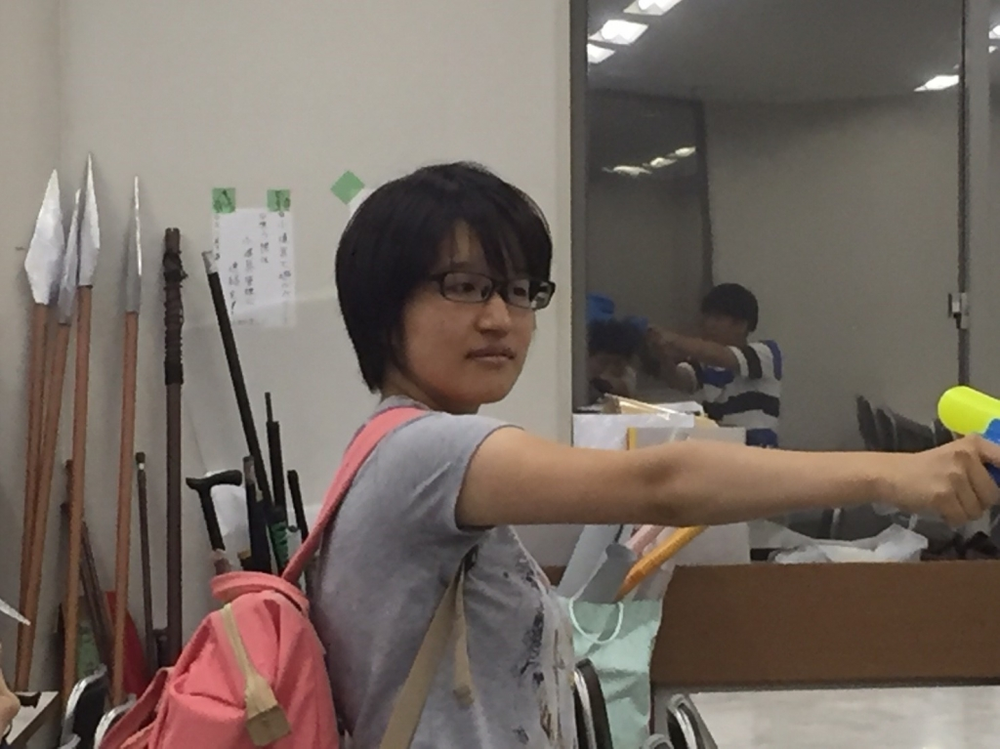

おはようございます！

視力は右1.5、左1.3のジンジャー紅(くれない)です！

好きな食べ物は納豆とキムチです！

前の文章を書いてからこの行を書くのに20分かかりました。

自己紹介がてら何か小噺をと思ったのですが……

なかなか難しいですね。

なので視力と見た目と好きな食べ物で私の内面を察してください。

今日は基礎練で初めてスイッチエチュードをしました！

このエチュードに限らないのですが、突然お題を振られたりすると人間って素が出るものですね。

キャラに幅を持たせるのも、表情を付けるのも、やっぱりまだまだ難しいです。

それだけ伸びしろがあって最高ですね。

まぁでもちょっとずつセリフも覚えてきましたし、

これは伸びてる証ですね。最高ですね。

今はとにかく演出さんに笑ってもらうのが目標です。

笑ってもらうのも褒められるのも大変嬉しいものですね！まだまだ出来てない部分は多いので精進して行きます。

伸びしろだらけのジンジャー紅でした。

写真はみかどのメガネを奪ったらチーム全員が敵になってしまった私です。

演出さんは誤って倒してしまいました。

嘘です。
