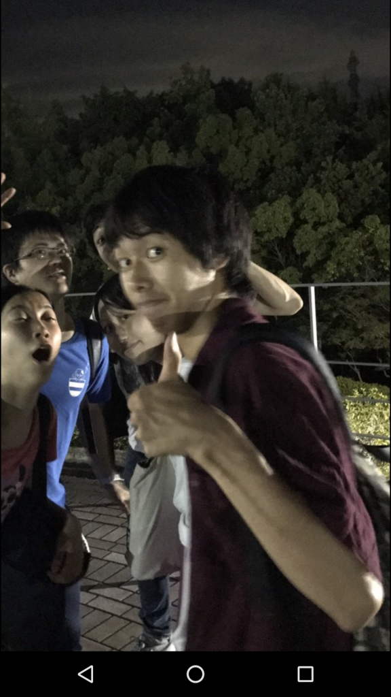

みなさんお疲れ様です、一回生（？）のガッシーです。テストが近づいてきたにも関わらず、万の人達はいつも通りハイテンションかつ奇抜なことをしてました（笑）。

おそらく万のメンバーで単位を落とす人はいないでしょう！（脅）。

基礎練は、アメンボダッシュと1wordエチュードです。

アメンボダッシュに関しては慣れてきたものの、タイミング・視線・滑舌・重心・表情など直すべきところが多々あるので日々精進していきたいですね。

エチュードではもっと先輩達を困らせるくらい話に介入したいと企んでおります。←できてない

しかし最も驚愕したのは他チーム（自分のチーム）の一回生スペックがかなり上がっていることでした。

今、危機感を覚えています。

（6年前から危機感を忘れたことはない）

彼らに負けないように、毎日ある稽古でも何か1つの知識を持って帰りたいですね。

（自分はYDKだと信じてる）

自己紹介は端的に済ませます。

浪人です。（実は現役）

アニメ・声優好きです。

自分の課題は声量と声圧を上げることなので、時間があれば手伝ってほしいです（笑）

テストもありますが、両立して乗り越えていきましょう！

以上がっしーでした。
