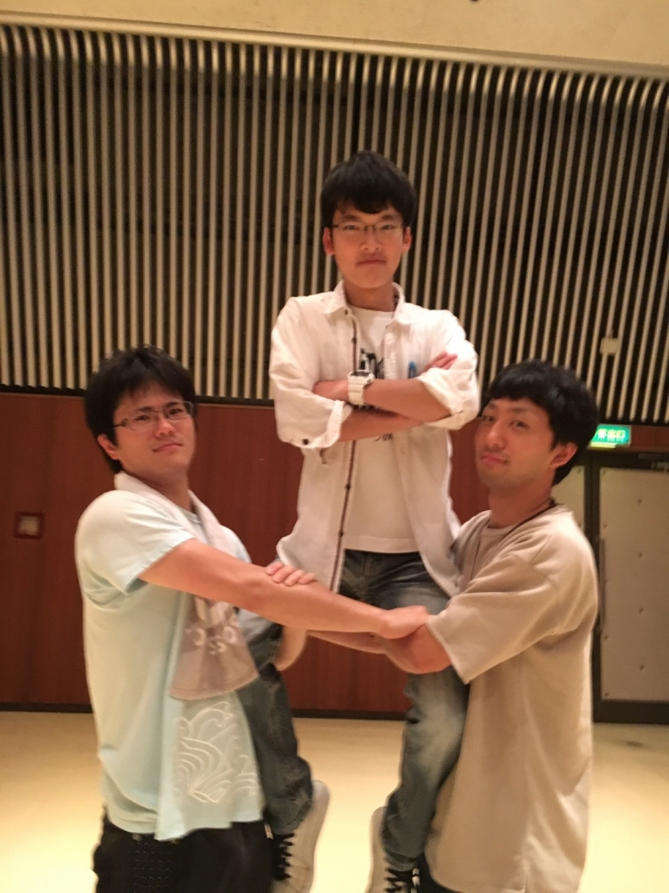
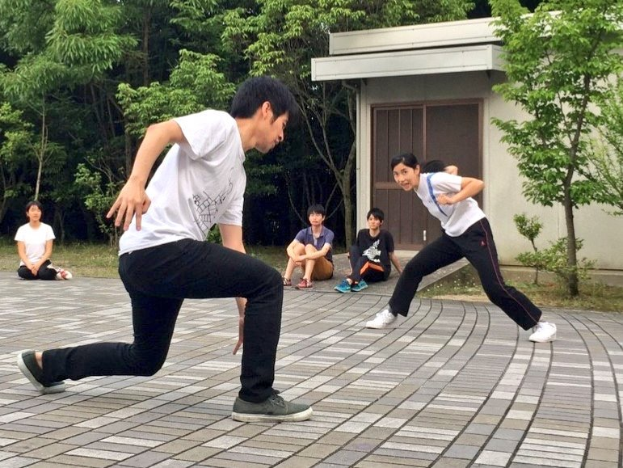

好きなスポーツは

テニス！

好きな食べ物は豚カツ！

前回自己紹介を忘れた

一回生のグレンです!!

ダンスの振り付けの確認やドレパをやりました

ダンスのタイミングとか難しいですね…

今日初めて押しし売りエチュードを初めてやりました

情報を入れつつ、自分を押すのは難しいな～と思いました！

表情とかもっとつけれたらよかったなと思いました！

## 夜ご飯はカレー

お久しぶりです！最近暑すぎてタオルが手放な

せなくなった栗田です！

熊背負いチームは稽古でよく体を動かすので楽

しいです！！

シーン回しの時、セリフを覚えてた1回生がいて

とてもびっくりしました！自分も早めに覚えな

いとなーと、いい刺激になりました！

写真は7ボウズの決勝戦です！

どうやら我らが演出さんでも精密機械を狂わす

ことは出来なかったみたいです！！
