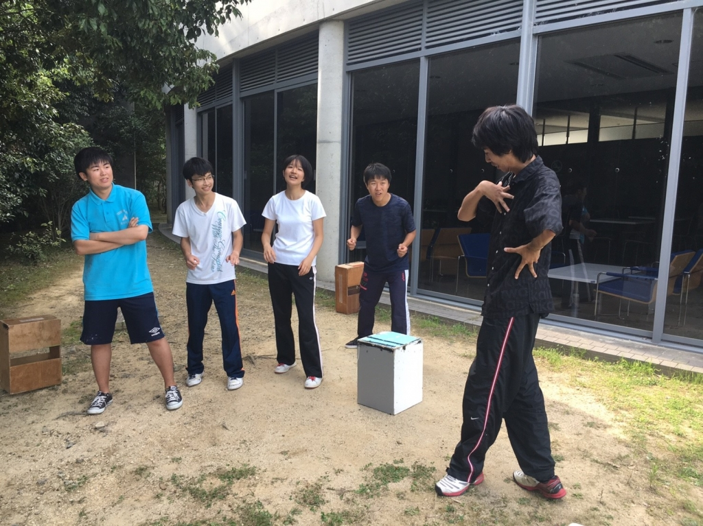

↑一回生オンリーエチュード。お題は「地球最後の日」

恐ろしく暑い日が続く中、皆様如何お過ごしでしょうか？どうも！三回生のジミーです！！

S棟を夜王チームに譲った我がベルチームは「流れ流れて風来坊」。生協前、テラス、院棟前から弾き出され、本日は珍しく食堂裏で稽古しました。

昨晩の荒通しも終わり、今日の稽古は「個々の課題に向き合う日」。シーン回しはせず、各々の課題(動きやセリフ回し云々)を練習しました。

一回生の熱意たるや凄いですね。「上手くなりたい」っていう意志がひしひしと伝わってきます。それぞれが自分と真剣に向き合って練習していました。

これは自分も負けてられない！頑張って高みを目指す事を改めて心に誓ったジミーでした。頑張れ俺！頑張れ一回生！

というわけで最近マインクラフトを始めたはいいが、妹に着々とニンテンドースイッチを占領され始めてるジミーでした。夢の舞台へ駆け上がれ！

P.S.Winnersってバンド凄くいいんで聞いてみてください。個人的に『蒼天ディライト』と『姫君バンゲット』がオススメです。
