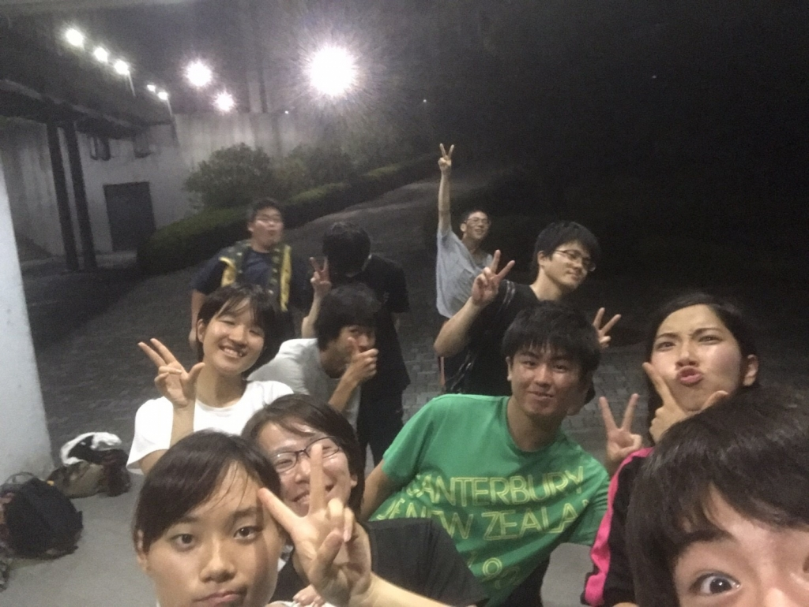

こんばんは！3回生の椎名真咲です！

最近の暑さに押され気味ではありますが、何とか食らいついております！

さて、今日の稽古はアメンボダッシュ、罰ゲーム付きのセブン坊主、階級エチュードをしました。

いやー、基礎練習って奥が深いですよね…

今さら何を言うか！って感じですが、基礎がしっかりしているからこそ、深みが出てくるものですからね！

それにしても、新入生の成長が目覚しいです。

稽古で見るたびに成長していて、私も負けてられませんね！精進せねば！！！

で、階級エチュードですね！これは、ほんとーーーに難しいです！

何度やっても、分からないときは分からないです…

周りとどれ位の階級の差があるのか、この人は上なのか？下なのか？

言葉遣い、姿勢、動き方などから自分はこの番号なんだ！と主張しなければならないために、あらゆる神経を鍛えることができるので、日常的にも応用できるかもしれません！

基礎練習の後はチームに分かれての稽古になります。

日を追うごとに役の研究を進めていて、私もさらに詳しく考えていかないといけないなと気を引き締めていこうと思います！

みんな本当に熱気が凄いんですよ！圧倒されてます…が、わたしも負けず、押し返せるぐらいのものを出さないといけないですね！頑張らねば！

では、皆様も暑さにはくれぐれもお気をつけ下さい！

今回の写真は、稽古終わりすぐに慌てて撮った写真です(あれ、私の顔が…)
