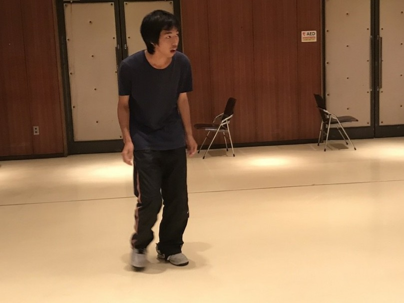

お疲れ様です、おはこんにちこんばんは！

(投稿時間は夜1時。おそようございます)

最近体重が50㌔を切り嬉しいベルです。

遂に２回目のブログが回って参りました。

毎日皆が書くブログを楽しみにしてますが、

私もワクワクドキドキするような文を書きたいぞ！

タップする指に力を込めていざ参りますね。

さて、チーム発表がされてから早１ヶ月。

階段のように１段ずつ着実に進化する人、

早くも想像の斜め上を行く演技をする人、

判断し難いグレーゾーンアドリブを狙ってくる人…

前半戦で後半戦もまだあるにも関わらず、

良い意味で幅広く癖が強いチームだなあと、

何度も何度も痛感させられています。

各々の魅力を最大限に引き出せるように、

演出としても腕がなるところですね。

視界を広く、臨んでいかなければ。

そして、今日がテスト前最終稽古でした。

基礎練習やシーン回しを見てビビる事。

１回生の成長がめんまぐるしい！！

￣￣￣￣￣￣￣￣￣￣￣￣￣￣￣￣

凄い。

アドバイスを直ぐに次に繋げるのみならず、

自分から積極的に色々質問しに来てくれて、

その度に判りやすくニンマリとしちゃいます。

この思いはきっと上回生も同じでしょうが、

そんな可愛い1回生のいとおしく強く思いに

しっかりコタえられるように動きたいです！

これまでもこれからも皆で創り上げます。

その様を、どうかお見守り下さいませ！

1ヶ月程先の本番でキラキラ輝く舞台を必ずや。

明日からはテスト休みに入ってゆきます。

他の2チームより少し長い期間になります。

(それでも例年と比べると短いのですが)

テスト明けの稽古では単位も台詞も完璧な！

皆に会えるのを楽しみにしています。

寧ろ、台本を外していなければ…

ベルの怖い一面を見る、かもしれませんね。

頑張りましょう^^

因みに、罰ゲームとしてクラウンを解禁しました。

挑戦者はすみれ、みかど、がっしー。

3人ともンマーッベラッス！な内容でしたので、

是非皆様にもこの笑いをと思いまして。

明日(7/20)から毎晩1人ずつ3日間にかけて、

呟きにてちょこっとだけお送りします。

お  た  の  し  み  に  。

以上、最近和風ドレも飲み味わうベルでした。

写真はガッシーのクラウンでのワンカット。

そのつぶらな瞳で何を語ったか乞うご期待。
