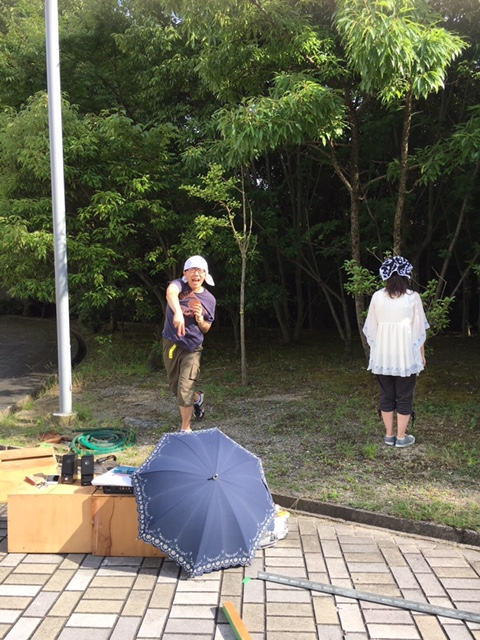

こんにちは！

今日の担当は3回生あおいです。

影薄くしてたのに同期によって指名され、今に至ります。

今日は建て込み稽古でした！

初建て込みという事もあり、1回生は慣れないのか少し初々しかったです。

段差に慣れるため基礎練では建て込み舞台を使って、音楽に合わせて動いたり、エチュードをしたりしてました。

テスト終わりの稽古でセリフ締切は過ぎているため、皆台本を外して頑張ってました。

台詞が完璧な人もいれば、時折飛ばしちゃって代読してる私が慌てふためく事も……笑

自主練中には先輩に教えてもらいながら発声練習してる1回生もいました…！

最初に比べて少しずつ声が出るようになってきてるので今後に期待ですね！

私も8月に入り、本格的に音を鳴らすようになりました。

サンプラーを持ち運ぶのは大変ですね。

でも他役職さんの大変さを知る良い機会となってます…！

あと何と言っても音鳴らすのは楽しいですね！

写真は休憩のひとコマ。

あまりの暑さに日陰でぼーっとしてます

知らないうちに撮られておりましたw

流石かめいさん良いピッチングです…！！笑

そして今日は20期生OBさんのアルゴさんが来てくださいました！！

役者さんもアドバイスを頂き、更にレベルアップしてました。

ありがとうございます！！

さて、最後にこの記事のタイトルについて。

そうです、今日は建て込み稽古だったんです。

炎天下での稽古だったんです。

2年前の夏、建て込み稽古の度に雨を降らし、1度しか建て込みが出来ないという伝説を残した私がいるのにも関わらずですよ。

雨女卒業出来たのか、それとも役者でないからなのか……。

来週にはキャンプも控えているので前者であって欲しいものです…。

雨の中の運転は嫌ですし、外で遊びたいですしね笑

以上、近頃民間ロケット打ち上げ失敗に残念だなと感じてるあおいでした。
