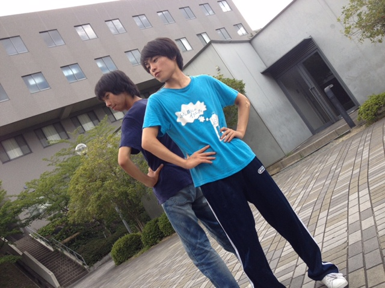
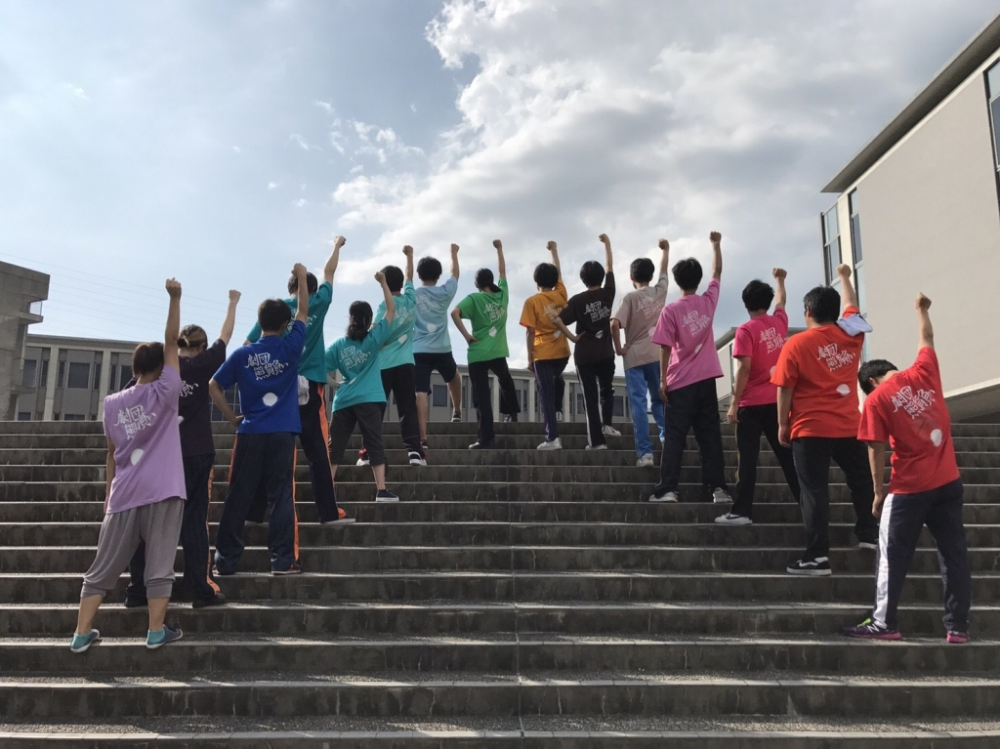

お久しぶりです。

勝男です。

暑くなりました。

もうすぐお盆休みですね。

みなさんは、どうお過ごしですか？

稽古場には、

13期生のねこさんが来てくださりました。

色々為になることを教わりました！

稽古場での熱気は、すごいです！

台風近づいてますね。

みなさんも、熱中症に気を付けて下さい。

それでは、楽しい夏休みを。

## 「ー」の数が異常に多い

こんにちは、最近自転車で山登りしていたデイビッドです。いやー、電動自転車とかロードバイクなら楽に登れるかもしれないですが、さすがに折りたたみ自転車となると総情の山を越えるのは厳しいですね。ちなみに下りは自転車が出してはいけないスピードが出るので山を自転車で登山する際は注意しましょう！

本日はノルー（台風5号）が近づいて来てる為か風が強く、台本を飛ばされる方がちらほらと。その中でも基礎練、アメンボダッシュ、エチュード、シーン回しと一人一人一生懸命取り組めていたと思います。特に自分はアメンボダッシュで体のブレがひどいので体ぶれ補正をしていきたいです！

写真は熊背負いのチームTシャツです。某有名マンガに出てくるあのシーンのポーズですね。このTシャツを着て心一つに通わせて最後の追い込みに向けて頑張りたいと思います。

明日からはキャンプという夢の日々が続いていくので、楽しさのあまり台本の内容を忘れそうとならないよう注意していきましょう！

では長々と失礼しましたが、最後に一人暮らしもそうそう簡単にうまくいくことばかりでないと感じるこのごろでした。

