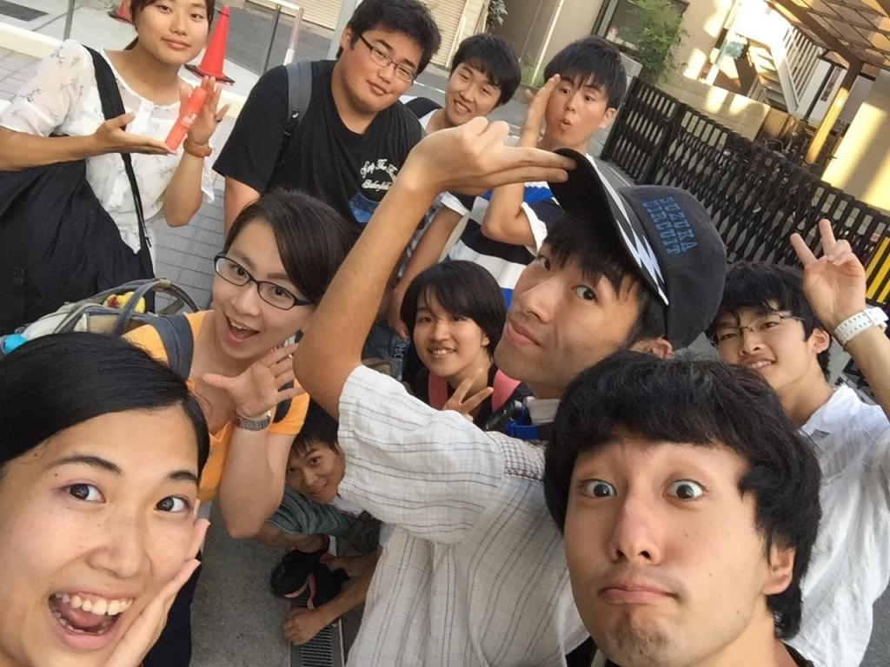

お久しぶりです!!

一回のグレンです！

今日は芥川公民館で稽古を行いました。一回生は初めてだったのですが、みんな動けててよかったのではないかなと思います。

本番もそうと遠くないので、セリフミスやセリフ飛びがないように、確実に覚えたいし、表情ももっと明確につけれたらなと思います！

練習あるのみですね！

稽古の後数名で芥川の河川敷で自主練を行いました。以前よりも上達したと思います！

あと、セブンポーズの罰ゲームでハイテンションエチュードをやってました。

ちょっとグダグタやった気もしないですが、罰ゲームをやらないように頑張りましょう！

本番まで頑張りましょう！
