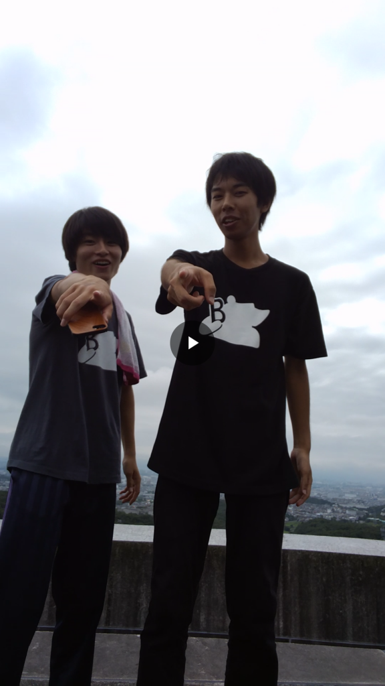

みなさん、お疲れ様です。がっしーです。

長期休暇（旅行）からの自主練は中々厳しいですね。正直、自分の体力の無さが悔やまれます。

さて、今日は3チームが学校に揃い、回生エチュードなるものをしました。

結果、やはり上回生との差は歴然、全てにおいて劣っていた気がします。話の展開、空間補充、表情、声、おもしろさ、などなど。しかし、一回生も成長しているところが多々見られたので、自分もいろいろ試していきたいところです。

さて、今日1つ疑問が浮かびました。

ある先輩から「ナンパのやり方を教えてよ」とよく分からない問を受け、K先輩（二人）に関しては、暑さでやられたのか僕に下ネタしか言いません。

何やら自分が他チームからも下ネタキャラいわゆる変態キャラが定着しているようです。

風評被害です。やめてください。

もし、そのような妄言を吐いている覚えのある方は僕に謝罪のメールを送ってくださいね。

話を戻して、稽古について。

今日は学校練習後、ふれあいで通しをしました。結果、大きいミスは無かったものの、修正すべき点は多いです。僕の場合は、台詞の波、動き、台詞無しの心情などでした。皆さんも、自分を客観的に見て何が足りないのか、ダメ出しの意味など考えていくといいかもしれません。

もう公演までラストスパート、全チーム最高の演劇を見せられるように頑張りましょう！

