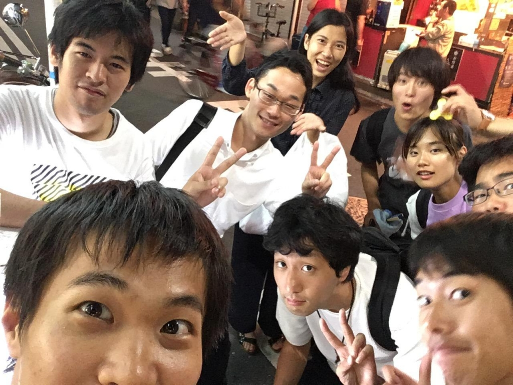
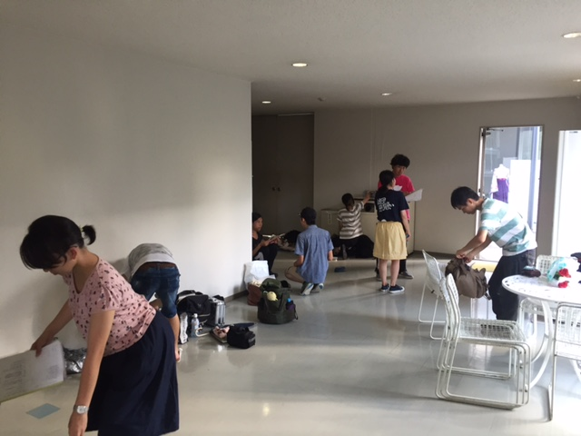

お疲れ様です。会長です。

今日は仕込み説明会でした。

あれやこれやを話し合い一週間後に控えた夏公に関して準備をしました。

何と言っても後一週間ですね。

長かったのか短かったのか、感じ方は人それぞれだと思います。

ですが、共通して言えるのは記憶に残る公演になれば嬉しいなってことです。

当たり前の話、楽しいことだけではなかったと思います。

それでも、思い返してみた時に楽しかったと言うことが出来るのであればそれは素敵な公演なのかなと。

まぁ、個人的にはまだ全然やることだらけで終わる気は微塵もしてないのですが

...

今日は稽古終わりに20期生の出雲さんとキャメロンさんにお会いすることが出来ました。

お二人に会うのも何だかとても懐かしく感じました。

本番もお待ちしております！

## 夏だ！暑い！ああああ

こんにちは。4回生のかめいです。

今日は通しがありました。

気温は32度

立ってるだけで汗だっくだくになる中、みんな頑張りました。僕も頑張りました。

本番まで残り数日。

ラストスパートって感じです。

稽古終わりに場当たり会議もしました。

ロッテリアで初めてマンゴー&ラッシーシェーキ飲みました。美味しいですね。

写真はダメ出しと帰る準備をしてるところです。
