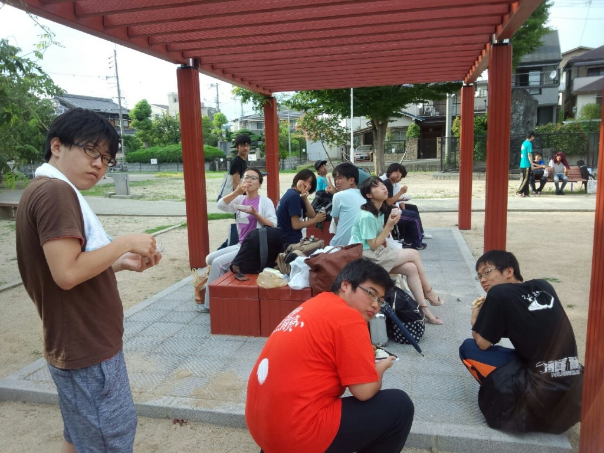

お疲れ様です。がっしーです。

もう夏公演まで稽古は今日一日のみとなりました。時間が経つのは早いものです。楽しい時間はどうしてこうも早く終わってしまうんですかね。ともかく本番は全チームが楽しくできると良いですね!

さて、ガッシー日記です。

稽古中にある先輩の頭が壊れたのか、もう見れたものじゃありません。でも稽古場では笑いの嵐が。僕も面白いのは大好きです、愛してます。やはり笑うとは良いものですね。

幸せだから笑うんじゃなくて笑うから幸せになるんだ的なことをどこぞのお偉いさんが言ってたような気がします。

僕等の公演でみんなが笑顔になれば何よりですね。書いてて恥ずかしいのでこのへんで。

長文失礼しました。

## 「いま、ここ」に強烈なスポットライトを当てる。

お疲れさまです。ミカドです。

3回目のブログが回ってきました。

今日は最終稽古でした。

そして明日から夏公が始まります。

3チームそれぞれの”夏”があり、それぞれの想いを胸

に本番を迎えます。

ツイッターで”6月16日”のチーム分けの日まで遡ります。

そしてふと考えます。

自分はこれで良かったのか…

ベストを尽くせたのか… と

「自分が劇場の舞台に立っている姿を想像します。こ

のとき、会場全体に蛍光灯がついていれば、客席の一

番奥まで見渡せます。

しかし、自分に”強烈なスポットライト”が当たってい

れば最前列さえ見えなくなるはずです。」

それは今の僕たちにとって大切な重要な見方だと思い

ます。

夏公全体に薄暗くぼんやりとした光を当てているから

こそ、過去や後ろを見てしまいます。いや、見えるよ

うな気がしてしまいます。

しかし、もしも「いま、ここ」に強烈なスポットライ

トを当てていたら、過去や後ろも見えなくなるでしょ

う。

つまり、僕たちはもっと「いま、ここ」を真剣に生き

るべきなのではないでしょうか？

まぁ、簡潔に言うなら、

「稽古も終わり、明日から夏公が始まるのだから腹く

くって一生懸命やれよッ」

ってことです。

長文失礼しました。最終稽古のブログということなの

で少し身構えちゃいました。

p.s.他の一回生より圧倒的に自分が写ってる写真が少ないことを気にするミカドですた。
