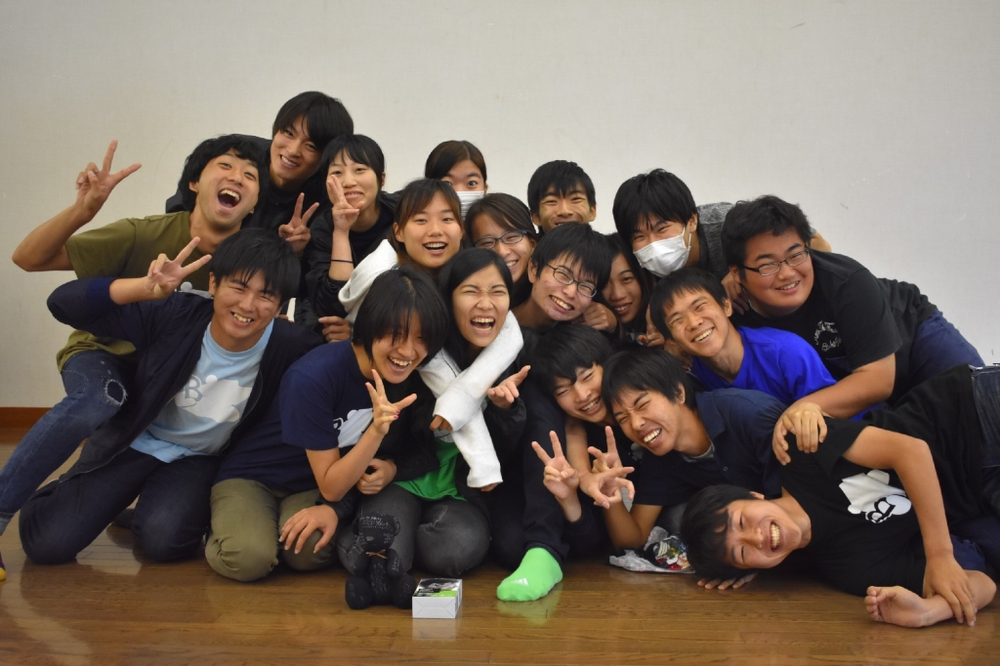

お疲れ様です。演出を務めさせて頂いておりました、ベルです。

ブログでの報告が大変遅くなりましたが、

劇団万絵巻2017年度第21回自主研究発表公演・劇団熊背負い、無事終演致しました。

ご来場頂いたOB、OGの皆様、ありがとうございました。

さて、このチームには様々な色のメンバー(役者)が集まってくれていました。

前座で活躍した1回生から、この夏で役者デビューする1回生、

役者として多くの公演で魅せて来た上回生から、スタッフワークメインな上回生。

いつも活発的な人から、人と話すのがあまり得意ではない人。

稽古にずっと参加してくれる人から、バイト等と両立させている人。

新鮮な面々に未知なる可能性を感じてワクワクする人も居れば、

慣れない面々で不安を感じた人も居たと思います。

私としては、だからこそ。楽しく且つ役者全員に刺激！を意識していましたが、

悔しい事にそう器用な人間でなく、頑張っても力不足で皆に頼る事もありました。

頼もしい上回生達にも引っ張って貰いながら大きな小さな一歩を進んでいくような日々でした。

演出としてはみっともない姿に見えていたかもしれません。

でも、例え頼りないと思われてもいいからこの公演を成功させたい。

そんな気持ちでいっぱいいっぱいでした。

そして、沢山笑い楽しみ悩んだその先、本番には。最初にブログで宣言した通りの、

【"全員が"輝ける万らしい楽しい公演】になってくれていました。

いきいきとし、高く高く設けた筈の理想形が舞台上に存在してくれていました。

客出しではお褒めのお言葉も多数頂き、その度にみっともない位に涙を流してました。

でも、チーム反省会では過去のようにワーワーと泣きはしませんでした。

演出の謎の最後の意地、泣いたら皆の顔がよく見えなくなるからなんて内に秘めながら。

これもまた、皆と同じく成長し強くなった１面なのかもしれませんね。

向上心を以て想像を超える成長ぶりを見せ、皆「夏公楽しかった！」と答えてくれた1回生。

先輩として後輩をリードしたりチームを盛り上げたり、特に舞台に華を添えてくれた2回生。

各々で各々なりに最大限出来る事をしっかりと考えて・全うしてくれた3回生。

安心出来る高いパフォーマンスと背筋がしゃんとする存在感を示して下さっていた4回生。

公演の成功は、一重に劇団員の皆のお陰です。

公演が終わった今でも、きっとこれからも、劇団員だった皆への気持ちは特別です。

楽しくて、かけがえのない夏でした。

本当に、本当に、本当に、ありがとうございました！！！
