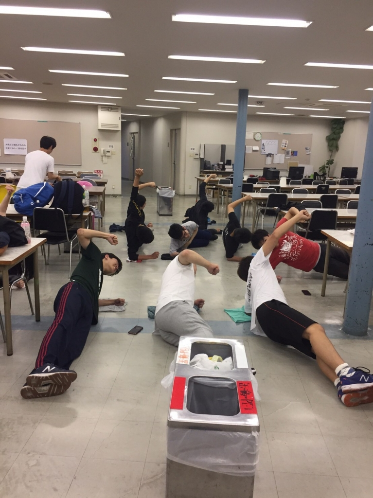

おはようございます、4回生のスギちゃんです。

とうとう稽古２回目にブログを書くほどの出世を果たしました。

今日も体幹トレーニングをしました。夜王チームの日々のルーティーンみたいなものですね。まだ二回目ですが腕と足とお腹がパンパンです。手を挙げるだけでも痛い。

今年の夏で最後なので、稽古一つ一つに重みを感じますね。夜王チームに選ばれてとても嬉しかったのですが、今まで見てきたチームの中でも頭の悪そうなチームだと思いました。夏公演までの日々がどんなものになるのか、全く予想できません。これからの毎日を充実したものにしたいですね。

写真はF-ZEROのレッドガゼルのポーズをしている風景です（独断と偏見）
