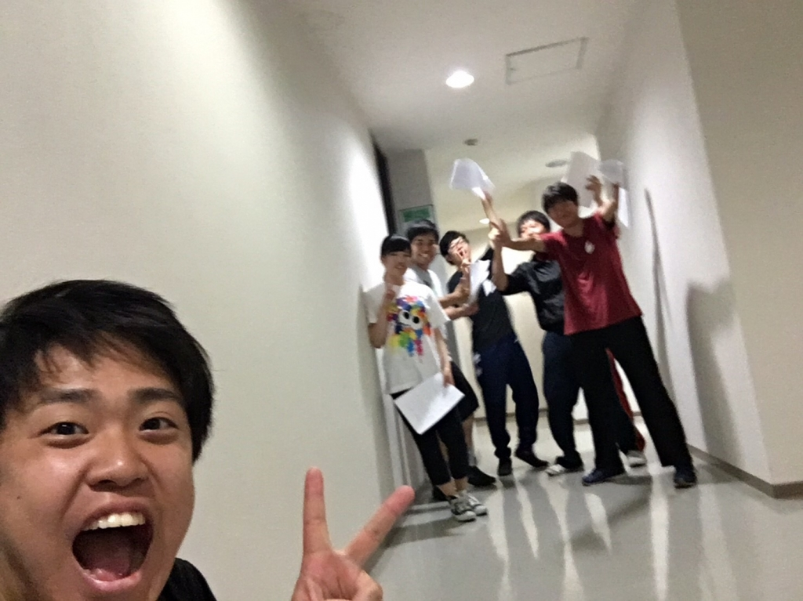
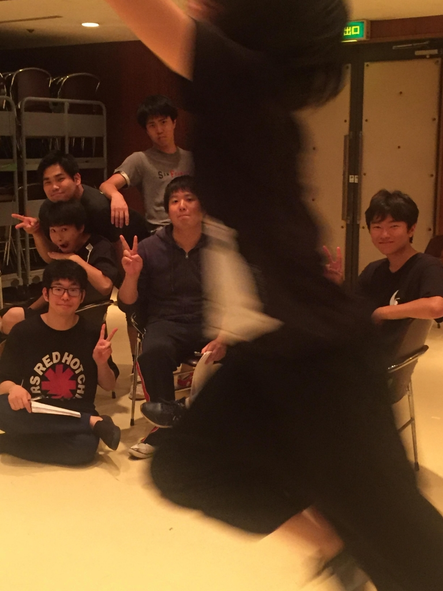

こんばんは、わさびです。

今日の基礎練は3チーム合同でした！やっぱり3チーム集まると人数が多いですねー、甘い香りが全然回ってきません笑

そんな稽古の中、雨がチラホラと降ってきました。もう梅雨ですね。空気がジメジメとしてくると、気持ちも落ち込んでしまいます...

でも大丈夫！！そんな空気に負けないのがうちのチームです！！

たとえ雨が降っていようと、部屋が狭かろうと、楽しく、元気に稽古してます！！

これから2カ月、一体どんなものができるのかワクワクしています！

## びゅんっ！

みなさんこんばんは、3回生のDJかおりです。

最近やっと梅雨らしいお天気になってきましたね。じめじめした気候はくせ毛の天敵なので、早く梅雨明けしてほしいと願うばかりです。

さて、今日の稽古はシーン回しでした。

私はスタッフなので初めてシーン回しを見たのですが、まだ台本を持っている段階なのに役者のみなさんがネタをぶっこんできていて何度も笑ってしまいました。中には台詞をほとんど覚えている人もいてびっくりです。

そんな夏吠え、次の稽古は荒通し！きっと今日以上にぶっこんできてくれるはず…！楽しみです！

以上、シーン回しでたくさん台詞を読ませてもらってちょっと楽しかったDJでした！

(写真の中でキメキメの男性陣の前を颯爽と横切る人影、誰かわかりますか…？笑)
