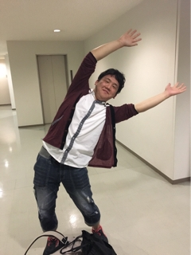

はじめまして、1回生の電竜丸です！名前の由来はポケモンのデンリュウが好きっていうことと高校まで剣道をやっていたということから侍っぽい名前にしたいとのことで電竜丸という名前になりました。みんなからはマルって呼ばれてます。

今日は初めて全力エチュードをしました。全力を出すって意外と難しいんですね、僕は恥ずかしがり屋なので大声を出すっていうことに抵抗を感じてしまいます。今回は役者をさせていただくので大きな声を出すために恥ずかしさを克服することが当面の目標です！

以上、最近「マルって冗談を真顔でいうから本気で言ってるのか分からなくて怖い」と言われ対処法がわからないことが悩みのマルでした！
