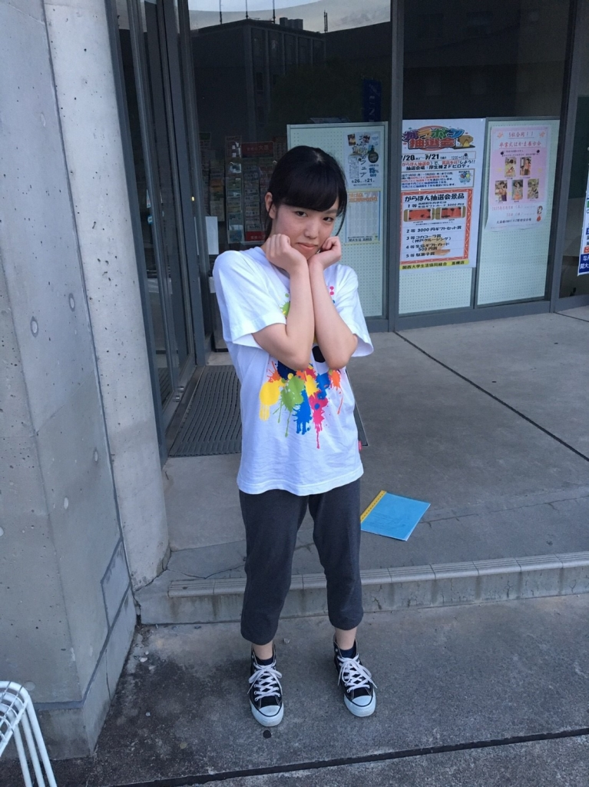

夏空が眩しく感じられる頃となりましたが、皆様いかがお過ごしでしょうか。演出さんから慎ましやかな文章をとの要望でしたので、全力でわたしの慎ましやかさをアピールしようと思います。

申し遅れました、1回生マッシュです。はじめまして。知り合いとすれ違いざまに「顔死んでるよ」って言われ続けて19歳になりました。未だにこんな自分が舞台に立つという実感が全くありませんが、夏公演では生き生きとした顔を皆様にお届けできるように頑張ります。

今日は初めてワンワードエチュードをしました。選ばれたワードは「やばい」「アラサー」「ささみ」…やばい。やばかったです。意思や感情を言葉で表せることの素晴らしさを改めて感じられた3分間でした。

チームに分かれてからはドレパや自主練、シーン回しなど。どこから手をつければいいのやらわからないぐらい課題だらけ、でも楽しい！自分の目標は、役者をやってみようと決めた当初「迷惑をかけないこと」だったのですが、今はもっと前向きな気持ちです。とにかく全力でがんばります！

以上、慎ましさゆえに可愛いポーズに不慣れな（写真参照）マッシュでした。

