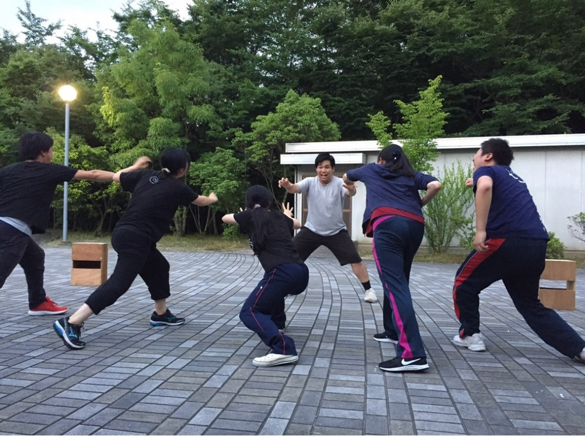

こんばんは、スギちゃんです。

最近暑い日が続き、急に雨が降り出したりして大変ですね。

昨日と今日は岐阜の実家にいたのですが、あっちはこっちよりジメジメしててメチャクチャ暑かったです。

犬山市大丈夫でしょうかね。

さて、スギちゃんによる二回目のブログ更新です。いやぁ、もう二回目か…。このペースなら三回目も回って来ますね。

今日は今日の稽古報告と一回生の自己紹介が羨ましかったので勝手に僕の自己紹介をします。

以下自己紹介なので読み飛ばしてもらって構いません。

僕の名前は杉野文哉で、芸名はスギちゃんと申します。年齢は２１歳です。岐阜県に住んでましたが、岐阜県に居たころの記憶がありません。

ベルチームにいるジミーの紹介で二回生から万絵巻に入部しました。

好きな食べ物は鶏肉です。趣味は色々ですが、色濃いものは戦闘機関連に触れることですかね。にわかですが、好きな戦闘機はF-14AとF-15Cです。F-22とSu-37も好きでしたが、強すぎるがゆえにロマンがないとのことで今では普通になりました。F-14Aは映画「トップガン」に出てくる奴で、F-15Cは片翼だけで生還したミラクル機体です。ガチ勢の人とはあまりお喋りできない状態なので、あまり大きい声出しては言えません。

役職は音響と広報の二刀流でしたが、TCから役者も経験し三刀流になりました。

最後に意気込みですが、まだ役者としては浅はかですが、色々と経験を積んでいる演出や同期、役者として先輩である後輩達から色々とスキルを盗みたいと思っております。夏公本番までには僕もチームを引っ張っていける人員になりたいですね。

今日の報告です。

パズーチームと合同基礎連をしました。

アメンボダッシュをしました。

まだ片手で数えられるほどしかアメンボダッシュをしたことがないのですが、難しいですね。目線は届いてるとドクトル君から褒められたので嬉しかったです。はい。

回生エチュードをしました。各回生やっぱりカラーが出ますね。一回生のみんなはこれが初めての回生エチュードなので、ここからどうやって上達していくのか楽しみです。僕も負けてられません。

明日は学校で通しです。台本が外れる日なので、みんなビクビクしてました。セリフが飛んだら恐い顔の人から何されるんでしょうかね。

写真は、お題「パワーレンジャー」で４回生による回生エチュード。

