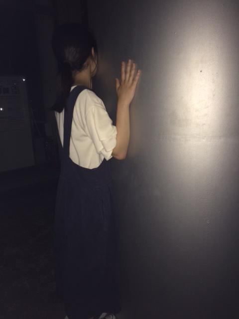
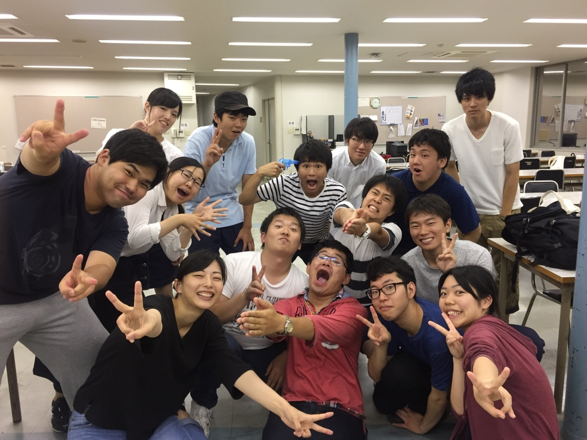

こんばんは、りんです。

暑かったりゲリラ豪雨が降ったりで最近たいへんですね…！

今日の稽古中も雨が降ってきたり雷が超光ったり鳴ったりでなかなか落ち着かなかったです

地元の駅から家に帰るまでにも雷がめちゃくちゃ光ってたんで暇つぶしに回数かぞえてたんですけどなんと80回以上ピカピカ光ってました…！

光るたびに雲のないところの空が一瞬青く見えて綺麗だと感じました。雷すごい。

さてさて、今日の稽古では階級エチュードをしたんですが難しいですね。

実際にやっている側も自分の立ち位置しかわかんないので探り合って関わりあって他の人の階級を推測していくっていう。

あと7ボウズもやりましたよ！

4回生になった今もリバースだけはダメです…笑

もっと頑張らねば…！

写真は 円柱にへばりつく一回生のマッシュです。

彼女いわく、「セミ」だそうです。欲を言うなら顔をこちらに向けて欲しかったですね。

## 雨ニモマケズ

こんばんは！3回生のDJかおりです！

早速今日の活動報告です！

今日は基礎練のあとシーン回しをしました！

新しい段取りもついてきて、ますます本番が楽しみな感じです！まだ完成していないのに、段取り付けを見ているだけでわくわくするので、本番で見たらもっともっとすごいものになっていると思います！早く音響もつけていきたいです！乞うご期待です！

そしてそして！今日は20期生のらむさんが遊びに来てくださいました！差し入れも美味しかったです！ありがとうございます！
