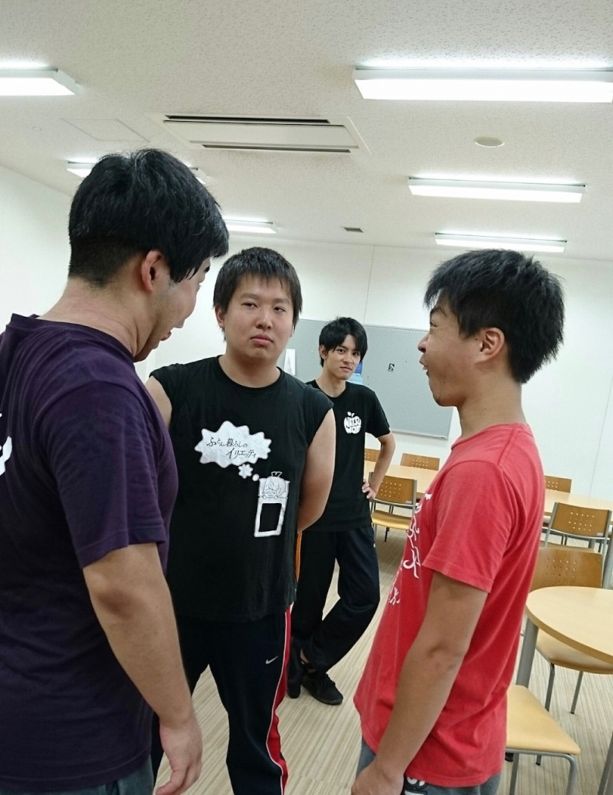

向日葵が今を盛りと咲き誇っておりますが、皆様お元気でお過ごしでしょうか。1回生マッシュです。

本日は3度目の建て込み稽古でした。基礎練はアメンボダッシュ、パワースピーチ、起承転結エチュードなど。エチュードをこなすごとに自分のキャラがブレつつありますが、なんとか尊厳を保ちたいですね。

セブンボウズでは2組に分かれ、70に到達しなかった方は罰ゲーム！緊張の中で行われた真剣勝負、結果は……両組とも到達ならず。罰ゲームは樽枝でした。足を引っ張っている自覚はあります。精進あるのみ。

お昼休憩を挟んでからは舞台を使ってのシーン回し、日差しと蝉の声に負けないようにみんな頑張っていました。明日から2日間のお盆休み！台本をさらに読み込んで、今よりもっともっと自分の演じる役について考えようと思います。

以上、ついに母親にまで顔死んでるよと言われたマッシュでした。

（画像は変顔大会の決勝戦です）

