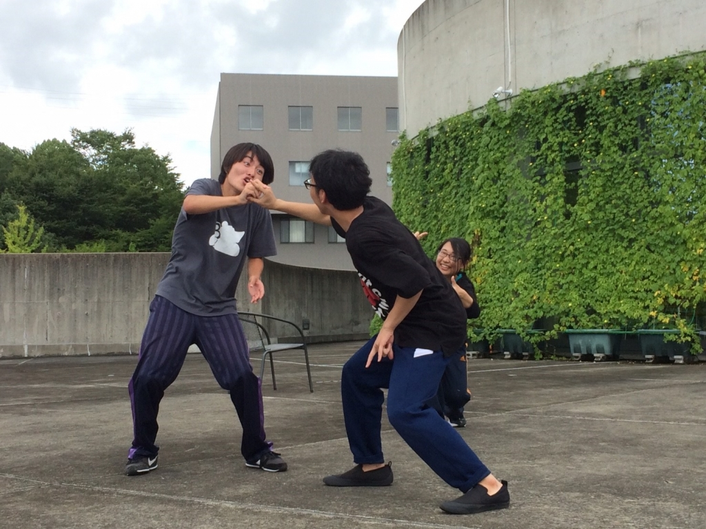

おはようございます！先日、体内の白血球が常人の半分とのことで健康診断に引っ掛かりました、4回生のはちをです。

昨日は久々に3チームでの合同基礎練でテンションを高めたあと、ブレストに尽力しました。暫く稽古場に顔を出せていなかったのですが、1回生の皆がしっかりとした台本への解釈を持っていたことにとても驚きました。

今回のブレストを通して各シーンの見せ場をみんなで共有したことで、ラストスパートを掛けられたらなぁと思います。

夏公演も早いもので、気づけば本番まであと10日を切っていました。残り少ない稽古時間でどれだけの思い出を作れるのか、また血液再検査で我が身の健全さを今度こそ証明することができるのか、本番までは当分ドキドキワクワクが止まりそうにありません！！
