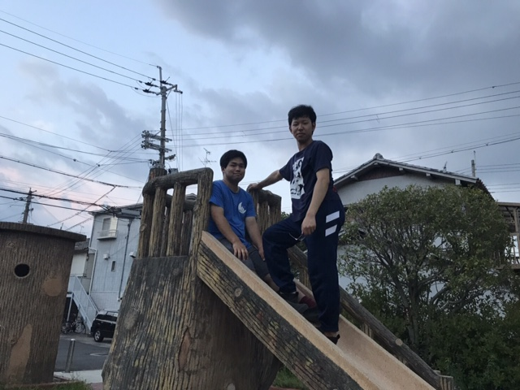
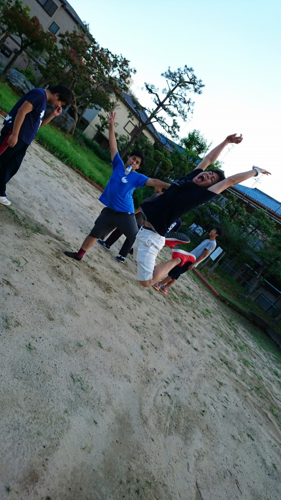

どうも、りんです。

本番が刻一刻と迫ってきていますね…！

もうあっという間で8月も終わろうとしています。夏って本当に長いようで短い。

さて、稽古も大詰めに差し掛かり、シーンをつなげて回すことが多くなってきました！長回しをするとお話しの流れが確認できて良いですね！

一回生もどんどん成長して最初の頃とは見違えるほどになっています！

私ももっと精進せねば…！！

写真は公園の遊具の上に登ってカメラに目線をくれている牧くんとスキャ姉です

どうでもいいですけど滑り台って滑る方から登りたくなりますよね！

以上、4回生のりんでしたー！

## ＲＵＮ！ ＲＵＮ！ＲＵＮ！

みなさんこんばんわ！！

三回目は飽きたわ！という人もいるかもしれませんが御容赦を！四回のマキがお送りします＼(^^)／

今日はドレリハを行いました！

実際の公演で使う衣装を用いてのリハだったので気持ちも入ったのではないかと思います！！

限りなく実際の公演に近いのでわからなかったとこなども発見できたりとのびしろを感じることができました。

夏公が間近に近づいてきているなか、ますます意欲的、精力的に打ち込んで稽古をしているみんなを見ているとまだまだもっとよく！面白いものができる！と感じ、ワクワクしますね！

今回の公演で打ち解けて、意外な一面を見せてくれた子や、仲良くなれた子、いつもの仲間と創った一夏の思い出、全力の公演を楽しみにしていてください((o(^∇^)o))

それではまた夏の公演で会いましょう！！

写真は自主練習でも全力でやる！というのを体で表現している演出です(笑)
