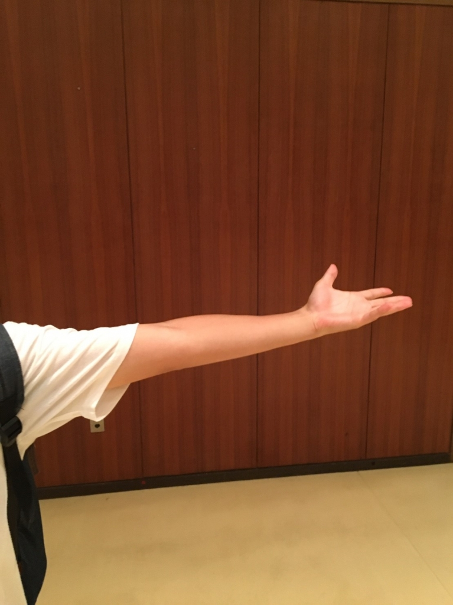

とうとう３回目のブログを書くことになりました、スギちゃんです。おそらく４回目は次回公演期間中にブログを書かされることになって、間違えてこっちのブログに書いちゃったときでしょう。

この夏を振り返ってみれば色々な事がありました。

二年連続キャンプ幹事をやらされ細かくタイムスケジュールを決めたのに台風のせいで台無しになったこと、何回もロゴのリテイクを喰らってバックレてふざけて出したアイデアが通ってしまったこと（これを言っていいのだろうか…）、ネガティブな思い出ばかりでしたがいい経験になったと思います。

何よりも、僕にとっては一回生と同じく夏公初役者なので新しい体験が毎日のようにあり、稽古場に行くことがとても楽しみでした。笑うときには笑う、真剣なときには真剣になる、メリハリのある稽古場作りを夜王チームが最も大事にしていることだと自覚しました。そのおかげか、一回生のみんなは稽古に積極的になり、ますます成長していっていますね。

今日は最後の通しでしたが、何度も見ているはずのクライマックスシーンで涙してしまいました。全員から妥協したくないという気持ちや前回の通しより更にクオリティの高い物にしてみせるという気持ちがあふれ出ていて、まだ公演が終わっていないので大きな声では言えませんが、本当にこのチームで頑張ってきたことを誇りに思います。あと稽古日数は二日間しかありません。最後の総仕上げですね。本番までにブラッシュアップしていきたいです。

写真は封印されしワサビの左腕です。
